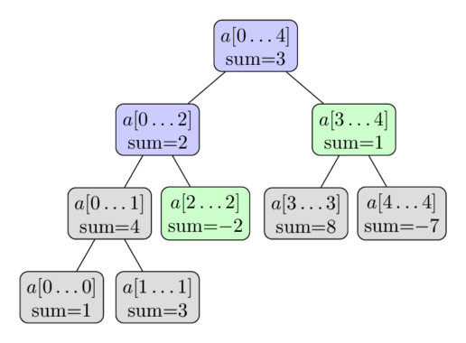

> Bài viết được dịch lại của trang: [cp-algorithm](https://cp-algorithms.com/data_structures/segment_tree.html)

# Segment Tree

A Segment Tree is a data structure that stores information about array intervals as a tree. This allows answering range queries over an array efficiently, while still being flexible enough to allow quick modification of the array.
This includes finding the sum of consecutive array elements $a[l \dots r]$, or finding the minimum element in a such a range in $O(\log n)$ time. 
Between answering such queries, the Segment Tree allows modifying the array by replacing one element, or even changing the elements of a whole subsegment (e.g. assigning all elements $a[l \dots r]$ to any value, or adding a value to all element in the subsegment). 
> Cây Segment (Segment Tree) là một cấu trúc dữ liệu lưu trữ thông tin về các khoảng (intervals) trong mảng dưới dạng một cây. Điều này cho phép trả lời các truy vấn theo khoảng trên mảng một cách hiệu quả, đồng thời vẫn đủ linh hoạt để cho phép thay đổi nhanh chóng mảng.
Điều này bao gồm việc tìm tổng các phần tử liên tiếp trong mảng $a[l \dots r]$, hoặc tìm phần tử nhỏ nhất trong một khoảng như vậy với thời gian $O(\log n)$.
Trong quá trình trả lời các truy vấn như vậy, Cây Segment cho phép sửa đổi mảng bằng cách thay thế một phần tử, hoặc thậm chí thay đổi các phần tử của một đoạn con (ví dụ: gán tất cả các phần tử $a[l \dots r]$ với một giá trị nào đó, hoặc cộng một giá trị vào tất cả các phần tử trong đoạn con đó).

In general, a Segment Tree is a very flexible data structure, and a huge number of problems can be solved with it. 
Additionally, it is also possible to apply more complex operations and answer more complex queries (see [Advanced versions of Segment Trees](segment_tree.md#advanced-versions-of-segment-trees)).
In particular the Segment Tree can be easily generalized to larger dimensions. 
For instance, with a two-dimensional Segment Tree you can answer sum or minimum queries over some subrectangle of a given matrix in only $O(\log^2 n)$ time. 
> Nói chung, Cây Segment là một cấu trúc dữ liệu rất linh hoạt, và một lượng lớn các bài toán có thể được giải quyết bằng nó. 
Ngoài ra, cũng có thể áp dụng các phép toán phức tạp hơn và trả lời các truy vấn phức tạp hơn.
Cụ thể, Cây Segment có thể dễ dàng được tổng quát hóa cho các chiều lớn hơn.
Chẳng hạn, với Cây Segment hai chiều, bạn có thể trả lời các truy vấn về tổng hoặc giá trị nhỏ nhất trên một subrectangle (hình chữ nhật con) của một ma trận cho trước trong chỉ $O(\log^2 n)$ thời gian.


One important property of Segment Trees is that they require only a linear amount of memory.
The standard Segment Tree requires $4n$ vertices for working on an array of size $n$. 
> Một đặc điểm quan trọng của Cây Segment là chúng chỉ yêu cầu một lượng bộ nhớ tuyến tính. 
Cây Segment chuẩn yêu cầu $4n$ đỉnh để hoạt động trên một mảng có kích thước $n$.


## Simplest form of a Segment Tree (Dạng đơn giản nhất của Cây Segment)

To start easy, we consider the simplest form of a Segment Tree. 
We want to answer sum queries efficiently. 
The formal definition of our task is:
Given an array $a[0 \dots n-1]$, the Segment Tree must be able to find the sum of elements between the indices $l$ and $r$ (i.e. computing the sum $\sum_{i=l}^r a[i]$), and also handle changing values of the elements in the array (i.e. perform assignments of the form $a[i] = x$).
The Segment Tree should be able to process **both** queries in $O(\log n)$ time.
> Để bắt đầu một cách dễ dàng, chúng ta xem xét dạng đơn giản nhất của Cây Segment.
Chúng ta muốn trả lời các truy vấn về tổng một cách hiệu quả.
Định nghĩa chính thức của bài toán của chúng ta là:
Cho một mảng $a[0 \dots n-1]$, Cây Segment phải có khả năng tìm tổng các phần tử giữa các chỉ số $l$ and $r$ (tức là tính tổng $\sum_{i=l}^r a[i]$), và cũng phải xử lý việc thay đổi giá trị của các phần tử trong mảng (tức là thực hiện các phép gán dưới dạng $a[i] = x$).
Cây Segment phải có khả năng xử lý cả hai truy vấn trong thời gian $O(\log n)$.


This is an improvement over the simpler approaches.
A naive array implementation - just using a simple array - can update elements in $O(1)$, but requires $O(n)$ to compute each sum query.
And precomputed prefix sums can compute sum queries in $O(1)$, but updating an array element requires $O(n)$ changes to the prefix sums.
> Đây là một cải tiến so với các phương pháp đơn giản hơn.
Một cách triển khai mảng ngây thơ - chỉ sử dụng một mảng đơn giản - có thể cập nhật các phần tử trong thời gian $O(1)$, nhưng yêu cầu $O(n)$ để tính mỗi truy vấn tổng.
Còn việc tính tổng truy vấn bằng cách sử dụng mảng tổng tiền tố đã được tính trước có thể thực hiện trong $O(1)$, nhưng việc cập nhật một phần tử trong mảng lại yêu cầu phải thay đổi $O(n)$ giá trị trong mảng tổng tiền tố.


### Structure of the Segment Tree (Cấu trúc của Cây Đoạn)

We can take a divide-and-conquer approach when it comes to array segments. 
We compute and store the sum of the elements of the whole array, i.e. the sum of the segment $a[0 \dots n-1]$. 
We then split the array into two halves $a[0 \dots n/2-1]$ and $a[n/2 \dots n-1]$ and compute the sum of each halve and store them. 
Each of these two halves in turn are split in half, and so on until all segments reach size $1$. 
> Chúng ta có thể áp dụng phương pháp chia để trị (divide-and-conquer) khi làm việc với các đoạn mảng.
Chúng ta tính toán và lưu trữ tổng của tất cả các phần tử trong mảng, tức là tổng của đoạn $a[0 \dots n-1]$. 
Sau đó, chúng ta chia mảng thành hai phần: $a[0 \dots n/2-1]$ và $a[n/2 \dots n-1]$ và tính tổng của mỗi phần rồi lưu trữ chúng. 
Mỗi phần trong số hai phần này lại tiếp tục được chia đôi, và quá trình này lặp lại cho đến khi tất cả các đoạn mảng có kích thước bằng $1$. 


We can view these segments as forming a binary tree: 
the root of this tree is the segment $a[0 \dots n-1]$, and each vertex (except leaf vertices) has exactly two child vertices. 
This is why the data structure is called "Segment Tree", even though in most implementations the tree is not constructed explicitly (see [Implementation](segment_tree.md#implementation)).
> Chúng ta có thể coi các đoạn mảng này tạo thành một cây nhị phân:
Gốc của cây này là đoạn $a[0 \dots n-1]$, và mỗi đỉnh (ngoại trừ các đỉnh lá) có chính xác hai đỉnh con. 
Đây là lý do tại sao cấu trúc dữ liệu này được gọi là "Cây Segment", mặc dù trong hầu hết các triển khai, cây không được xây dựng một cách rõ ràng.

Here is a visual representation of such a Segment Tree over the array $a = [1, 3, -2, 8, -7]$:
> Dưới đây là một biểu diễn trực quan của Cây Segment như vậy trên mảng $a = [1, 3, -2, 8, -7]$:


From this short description of the data structure, we can already conclude that a Segment Tree only requires a linear number of vertices. 
The first level of the tree contains a single node (the root), the second level will contain two vertices, in the third it will contain four vertices, until the number of vertices reaches $n$. 
Thus the number of vertices in the worst case can be estimated by the sum $1 + 2 + 4 + \dots + 2^{\lceil\log_2 n\rceil} \lt 2^{\lceil\log_2 n\rceil + 1} \lt 4n$.
> Từ mô tả ngắn gọn về cấu trúc dữ liệu này, chúng ta có thể kết luận rằng một Cây Segment chỉ yêu cầu một số lượng đỉnh tuyến tính.
Cấp đầu tiên của cây chứa một đỉnh duy nhất (gốc), cấp thứ hai sẽ chứa hai đỉnh, cấp thứ ba sẽ chứa bốn đỉnh, và cứ tiếp tục như vậy cho đến khi số lượng đỉnh đạt $n$. 
Do đó, số lượng đỉnh trong trường hợp xấu nhất có thể được ước tính bằng tổng $1 + 2 + 4 + \dots + 2^{\lceil\log_2 n\rceil} \lt 2^{\lceil\log_2 n\rceil + 1} \lt 4n$.


It is worth noting that whenever $n$ is not a power of two, not all levels of the Segment Tree will be completely filled. 
We can see that behavior in the image.
For now we can forget about this fact, but it will become important later during the implementation.
> Cần lưu ý rằng khi $n$ không phải là một số mũ của hai, không phải tất cả các cấp của Cây Segment sẽ được điền đầy đủ.
Chúng ta có thể thấy hành vi này trong hình ảnh.
Hiện tại, chúng ta có thể bỏ qua thực tế này, nhưng nó sẽ trở nên quan trọng sau này trong quá trình triển khai.


The height of the Segment Tree is $O(\log n)$, because when going down from the root to the leaves the size of the segments decreases approximately by half. 
> Chiều cao của Cây Segment là $O(\log n)$, vì khi di chuyển từ gốc đến các lá, kích thước của các đoạn mảng giảm dần một cách gần như gấp đôi.


### Construction (Xây dựng)

Before constructing the segment tree, we need to decide:
> Trước khi xây dựng cây đoạn, chúng ta cần quyết định rằng:

1. the *value* that gets stored at each node of the segment tree.
   For example, in a sum segment tree, a node would store the sum of the elements in its range $[l, r]$.
2. the *merge* operation that merges two siblings in a segment tree.
   For example, in a sum segment tree, the two nodes corresponding to the ranges $a[l_1 \dots r_1]$ and $a[l_2 \dots r_2]$ would be merged into a node corresponding to the range $a[l_1 \dots r_2]$ by adding the values of the two nodes.
> 1. the *value* được lưu trữ tại mỗi nút của cây phân đoạn.
   Ví dụ, trong cây phân đoạn tổng, một nút sẽ lưu trữ tổng của các phần tử trong phạm vi $[l, r]$ của nó.
> 2. the *merge* operation dùng để hợp nhất hai nút con trong cây đoạn.
   Ví dụ, trong cây đoạn tổng, hai nút tương ứng với các phạm vi $a[l_1 \dots r_1]$ và $a[l_2 \dots r_2]$ sẽ được hợp nhất thành một nút tương ứng với phạm vi $a[l_1 \dots r_2]$ bằng cách cộng giá trị của hai nút này lại với nhau.


Note that a vertex is a "leaf vertex", if its corresponding segment covers only one value in the original array. It is present at the lowermost level of a segment tree. Its value would be equal to the (corresponding) element $a[i]$. 
> Lưu ý rằng một đỉnh là "đỉnh lá" (leaf vertex) nếu đoạn tương ứng của nó chỉ bao phủ một giá trị trong mảng gốc. Nó xuất hiện ở cấp thấp nhất của cây đoạn. Giá trị của nó sẽ bằng với phần tử (tương ứng) $a[i]$.

Now, for construction of the segment tree, we start at the bottom level (the leaf vertices) and assign them their respective values. On the basis of these values, we can compute the values of the previous level, using the `merge` function.
And on the basis of those, we can compute the values of the previous, and repeat the procedure until we reach the root vertex. 
> Bây giờ, để xây dựng cây đoạn, chúng ta bắt đầu từ cấp thấp nhất (các đỉnh lá) và gán cho chúng các giá trị tương ứng. Dựa trên các giá trị này, chúng ta có thể tính toán giá trị của cấp trước đó, sử dụng hàm `merge` .
Và dựa trên các giá trị đó, chúng ta có thể tính toán giá trị của cấp trước đó, và lặp lại quy trình cho đến khi đạt đến đỉnh gốc.


It is convenient to describe this operation recursively in the other direction, i.e., from the root vertex to the leaf vertices. The construction procedure, if called on a non-leaf vertex, does the following:
> Thật tiện lợi khi mô tả phép toán này một cách đệ quy theo hướng ngược lại, tức là từ đỉnh gốc đến các đỉnh lá. Quy trình xây dựng, nếu được gọi trên một đỉnh không phải lá, sẽ thực hiện các bước sau:

1. recursively construct the values of the two child vertices
2. merge the computed values of these children.
> 1. Đệ quy xây dựng các giá trị của hai đỉnh con.
> 2. Hợp nhất các giá trị đã tính toán của các đỉnh con này.


We start the construction at the root vertex, and hence, we are able to compute the entire segment tree.
> Chúng ta bắt đầu xây dựng từ đỉnh gốc, và do đó, có thể tính toán toàn bộ cây phân đoạn.


The time complexity of this construction is $O(n)$, assuming that the merge operation is constant time (the merge operation gets called $n$ times, which is equal to the number of internal nodes in the segment tree).
> Độ phức tạp thời gian của quá trình xây dựng này là $O(n)$, giả sử rằng phép hợp nhất có độ phức tạp thời gian hằng số (phép hợp nhất được gọi $n$ lần, tương đương với số lượng các nút nội tại trong cây đoạn).

### Sum queries (Truy vấn tổng)

For now we are going to answer sum queries. As an input we receive two integers $l$ and $r$, and we have to compute the sum of the segment $a[l \dots r]$ in $O(\log n)$ time. 
> Hiện tại, chúng ta sẽ trả lời các truy vấn tổng. Như một đầu vào, chúng ta nhận hai số nguyên $l$ và $r$, và chúng ta phải tính tổng của đoạn $a[l \dots r]$ trong thời gian $O(\log n)$. 

To do this, we will traverse the Segment Tree and use the precomputed sums of the segments.
Let's assume that we are currently at the vertex that covers the segment $a[tl \dots tr]$.
There are three possible cases. 
> Để làm điều này, chúng ta sẽ duyệt qua Cây Phân Đoạn và sử dụng các tổng đã được tính toán trước của các đoạn.
Giả sử rằng chúng ta hiện đang ở đỉnh bao phủ đoạn $a[tl \dots tr]$.
Có ba trường hợp khả thi.


The easiest case is when the segment $a[l \dots r]$ is equal to the corresponding segment of the current vertex (i.e. $a[l \dots r] = a[tl \dots tr]$), then we are finished and can return the precomputed sum that is stored in the vertex.
> Trường hợp dễ nhất là khi đoạn $a[l \dots r]$ bằng với đoạn tương ứng của đỉnh hiện tại (tức là $a[l \dots r] = a[tl \dots tr]$), khi đó chúng ta đã hoàn thành và có thể trả về tổng đã được tính toán trước và lưu trữ trong đỉnh.


Alternatively the segment of the query can fall completely into the domain of either the left or the right child.
Recall that the left child covers the segment $a[tl \dots tm]$ and the right vertex covers the segment $a[tm + 1 \dots tr]$ with $tm = (tl + tr) / 2$. 
In this case we can simply go to the child vertex, which corresponding segment covers the query segment, and execute the algorithm described here with that vertex. 
> Ngoài ra, đoạn của truy vấn có thể rơi hoàn toàn vào miền của một trong hai đỉnh con.
Nhớ rằng đỉnh trái bao phủ đoạn $a[tl \dots tm]$ và đỉnh phải bao phủ đoạn $a[tm + 1 \dots tr]$ với $tm = (tl + tr) / 2$. 
Trong trường hợp này, chúng ta có thể đơn giản di chuyển đến đỉnh con mà đoạn tương ứng của nó bao phủ đoạn truy vấn, và thực hiện thuật toán đã được mô tả ở đây với đỉnh đó. 


And then there is the last case, the query segment intersects with both children. 
In this case we have no other option as to make two recursive calls, one for each child.
First we go to the left child, compute a partial answer for this vertex (i.e. the sum of values of the intersection between the segment of the query and the segment of the left child), then go to the right child, compute the partial answer using that vertex, and then combine the answers by adding them. 
In other words, since the left child represents the segment $a[tl \dots tm]$ and the right child the segment $a[tm+1 \dots tr]$, we compute the sum query $a[l \dots tm]$ using the left child, and the sum query $a[tm+1 \dots r]$ using the right child. 
> Và sau đó là trường hợp cuối cùng, khi đoạn truy vấn giao với cả hai đỉnh con.
Trong trường hợp này, chúng ta không có lựa chọn nào khác ngoài việc thực hiện hai cuộc gọi đệ quy, mỗi cuộc gọi cho một đỉnh con.
Trước tiên, chúng ta đi đến đỉnh trái, tính toán một phần kết quả cho đỉnh này (tức là tổng các giá trị của phần giao nhau giữa đoạn truy vấn và đoạn của đỉnh trái), sau đó đi đến đỉnh phải, tính toán kết quả phần của nó, và cuối cùng kết hợp các kết quả bằng cách cộng chúng lại.
Nói cách khác, vì đỉnh trái đại diện cho đoạn $a[tl \dots tm]$ và đỉnh phải đại diện cho đoạn $a[tm+1 \dots tr]$, chúng ta tính tổng truy vấn $a[l \dots tm]$ sử dụng đỉnh trái, và tổng truy vấn $a[tm+1 \dots r]$ sử dụng đỉnh phải. 


So processing a sum query is a function that recursively calls itself once with either the left or the right child (without changing the query boundaries), or twice, once for the left and once for the right child (by splitting the query into two subqueries). 
And the recursion ends, whenever the boundaries of the current query segment coincides with the boundaries of the segment of the current vertex. 
In that case the answer will be the precomputed value of the sum of this segment, which is stored in the tree.
> Vì vậy, việc xử lý một truy vấn tổng là một hàm đệ quy gọi chính nó một lần với đỉnh trái hoặc đỉnh phải (mà không thay đổi biên giới của truy vấn), hoặc hai lần, một lần cho đỉnh trái và một lần cho đỉnh phải (bằng cách chia truy vấn thành hai truy vấn con).
Và đệ quy sẽ kết thúc khi biên giới của đoạn truy vấn hiện tại trùng với biên giới của đoạn của đỉnh hiện tại.
Trong trường hợp đó, câu trả lời sẽ là giá trị đã được tính toán trước của tổng của đoạn này, được lưu trữ trong cây.


In other words, the calculation of the query is a traversal of the tree, which spreads through all necessary branches of the tree, and uses the precomputed sum values of the segments in the tree. 
> Nói cách khác, việc tính toán truy vấn là một phép duyệt qua cây, lan rộng qua tất cả các nhánh cần thiết của cây, và sử dụng các giá trị tổng đã được tính toán trước của các đoạn trong cây.


Obviously we will start the traversal from the root vertex of the Segment Tree.
> Hiển nhiên, chúng ta sẽ bắt đầu việc duyệt từ đỉnh gốc của Cây Phân Đoạn.


The procedure is illustrated in the following image.
Again the array $a = [1, 3, -2, 8, -7]$ is used, and here we want to compute the sum $\sum_{i=2}^4 a[i]$.
The colored vertices will be visited, and we will use the precomputed values of the green vertices.
This gives us the result $-2 + 1 = -1$.
> Quy trình này được minh họa trong hình dưới đây.
Một lần nữa, mảng $a = [1, 3, -2, 8, -7]$ được sử dụng, và ở đây chúng ta muốn tính tổng $\sum_{i=2}^4 a[i]$.
Các đỉnh được tô màu sẽ được thăm, và chúng ta sẽ sử dụng các giá trị đã tính toán trước của các đỉnh màu xanh lá cây.
Kết quả thu được là $-2 + 1 = -1$.




Why is the complexity of this algorithm $O(\log n)$?
To show this complexity we look at each level of the tree. 
It turns out, that for each level we only visit not more than four vertices. 
And since the height of the tree is $O(\log n)$, we receive the desired running time. 
> Tại sao độ phức tạp của thuật toán này là $O(\log n)$?
Để chứng minh độ phức tạp này, chúng ta xem xét từng cấp của cây.
Hóa ra, ở mỗi cấp, chúng ta chỉ thăm không quá bốn đỉnh.
Và vì chiều cao của cây là $O(\log n)$, chúng ta có được thời gian thực thi mong muốn.


We can show that this proposition (at most four vertices each level) is true by induction.
At the first level, we only visit one vertex, the root vertex, so here we visit less than four vertices. 
Now let's look at an arbitrary level.
By induction hypothesis, we visit at most four vertices. 
If we only visit at most two vertices, the next level has at most four vertices. That is trivial, because each vertex can only cause at most two recursive calls. 
So let's assume that we visit three or four vertices in the current level. 
From those vertices, we will analyze the vertices in the middle more carefully. 
Since the sum query asks for the sum of a continuous subarray, we know that segments corresponding to the visited vertices in the middle will be completely covered by the segment of the sum query. 
Therefore these vertices will not make any recursive calls. 
So only the most left, and the most right vertex will have the potential to make recursive calls. 
And those will only create at most four recursive calls, so also the next level will satisfy the assertion.
We can say that one branch approaches the left boundary of the query, and the second branch approaches the right one. 
> Chúng ta có thể chứng minh rằng phát biểu này (tối đa bốn đỉnh mỗi cấp) là đúng bằng phương pháp quy nạp.
Ở cấp đầu tiên, chúng ta chỉ thăm một đỉnh, đỉnh gốc, vì vậy ở đây chúng ta thăm ít hơn bốn đỉnh.
Bây giờ, hãy xem xét một cấp bất kỳ.
Theo giả thuyết quy nạp, chúng ta thăm tối đa bốn đỉnh.
Nếu chúng ta chỉ thăm tối đa hai đỉnh, thì cấp tiếp theo sẽ có tối đa bốn đỉnh. Điều này là hiển nhiên, vì mỗi đỉnh chỉ có thể gây ra tối đa hai cuộc gọi đệ quy.
Vậy hãy giả sử rằng chúng ta thăm ba hoặc bốn đỉnh ở cấp hiện tại.
Từ những đỉnh này, chúng ta sẽ phân tích kỹ hơn các đỉnh ở giữa.
Vì truy vấn tổng yêu cầu tính tổng của một dãy con liên tiếp, chúng ta biết rằng các đoạn tương ứng với các đỉnh đã thăm ở giữa sẽ hoàn toàn được bao phủ bởi đoạn của truy vấn tổng.
Do đó, các đỉnh này sẽ không tạo ra bất kỳ cuộc gọi đệ quy nào.
Vậy chỉ có đỉnh trái nhất và đỉnh phải nhất mới có khả năng tạo ra các cuộc gọi đệ quy.
Và chúng chỉ tạo ra tối đa bốn cuộc gọi đệ quy, vì vậy cấp tiếp theo cũng sẽ thỏa mãn phát biểu này.
Chúng ta có thể nói rằng một nhánh tiếp cận biên trái của truy vấn, và nhánh còn lại tiếp cận biên phải của truy vấn.


Therefore we visit at most $4 \log n$ vertices in total, and that is equal to a running time of $O(\log n)$. 
> Do đó, chúng ta thăm tối đa $4 \log n$ đỉnh tổng cộng, và điều này tương đương với thời gian thực thi $O(\log n)$. 


In conclusion the query works by dividing the input segment into several sub-segments for which all the sums are already precomputed and stored in the tree. 
And if we stop partitioning whenever the query segment coincides with the vertex segment, then we only need $O(\log n)$ such segments, which gives the effectiveness of the Segment Tree. 
> Tóm lại, truy vấn hoạt động bằng cách chia đoạn đầu vào thành nhiều đoạn con, với tất cả các tổng đã được tính toán trước và lưu trữ trong cây.
Và nếu chúng ta dừng việc phân chia khi đoạn truy vấn trùng với đoạn của đỉnh, thì chúng ta chỉ cần tối đa $O(\log n)$ đoạn như vậy, điều này giải thích hiệu quả của Cây Phân Đoạn.


### Update queries (Truy vấn cập nhật)

Now we want to modify a specific element in the array, let's say we want to do the assignment $a[i] = x$. 
And we have to rebuild the Segment Tree, such that it corresponds to the new, modified array. 
> Bây giờ, chúng ta muốn sửa đổi một phần tử cụ thể trong mảng, giả sử chúng ta muốn thực hiện phép gán $a[i] = x$. 
Và chúng ta phải xây dựng lại Cây Đoạn, sao cho nó tương ứng với mảng đã được sửa đổi mới.


This query is easier than the sum query. 
Each level of a Segment Tree forms a partition of the array. 
Therefore an element $a[i]$ only contributes to one segment from each level. 
Thus only $O(\log n)$ vertices need to be updated. 
> Truy vấn này dễ dàng hơn truy vấn tổng.
Mỗi cấp của Cây Phân Đoạn tạo thành một phân hoạch của mảng.
Do đó, một phần tử $a[i]$ chỉ đóng góp vào một đoạn tại mỗi cấp.
Vì vậy, chỉ cần cập nhật $O(\log n)$ đỉnh.


It is easy to see, that the update request can be implemented using a recursive function. 
The function gets passed the current tree vertex, and it recursively calls itself with one of the two child vertices (the one that contains $a[i]$ in its segment), and after that recomputes its sum value, similar how it is done in the build method (that is as the sum of its two children). 
> Rất dễ thấy rằng yêu cầu cập nhật có thể được triển khai bằng một hàm đệ quy.
Hàm này nhận đỉnh cây hiện tại làm đối số, và nó sẽ gọi đệ quy với một trong hai đỉnh con (đỉnh chứa $a[i]$ trong đoạn của nó), sau đó tính lại giá trị tổng của đỉnh đó, tương tự như cách thực hiện trong phương thức xây dựng (tức là tổng của hai đỉnh con của nó).


Again here is a visualization using the same array.
Here we perform the update $a[2] = 3$.
The green vertices are the vertices that we visit and update.
> Một lần nữa, đây là hình minh họa sử dụng mảng giống như trước.
Ở đây, chúng ta thực hiện cập nhật $a[2] = 3$.
Các đỉnh màu xanh lá cây là các đỉnh mà chúng ta thăm và cập nhật.


### Implementation 

The main consideration is how to store the Segment Tree.
Of course we can define a $\text{Vertex}$ struct and create objects, that store the boundaries of the segment, its sum and additionally also pointers to its child vertices.
However, this requires storing a lot of redundant information in the form of pointers.
We will use a simple trick to make this a lot more efficient by using an _implicit data structure_: Only storing the sums in an array.
(A similar method is used for binary heaps).
The sum of the root vertex at index 1, the sums of its two child vertices at indices 2 and 3, the sums of the children of those two vertices at indices 4 to 7, and so on. 
With 1-indexing, conveniently the left child of a vertex at index $i$ is stored at index $2i$, and the right one at index $2i + 1$. 
Equivalently, the parent of a vertex at index $i$ is stored at $i/2$ (integer division).
> Điều quan trọng chính là cách lưu trữ Cây Phân Đoạn.
Tất nhiên, chúng ta có thể định nghĩa một cấu trúc $\text{Vertex}$ và tạo ra các đối tượng lưu trữ biên giới của đoạn, tổng của nó và thêm vào đó là các con trỏ đến các đỉnh con của nó.
Tuy nhiên, cách này yêu cầu lưu trữ rất nhiều thông tin thừa dưới dạng con trỏ.
Chúng ta sẽ sử dụng một mẹo đơn giản để làm điều này hiệu quả hơn nhiều bằng cách sử dụng một _implicit data structure_: chỉ lưu trữ các tổng trong một mảng.
(Một phương pháp tương tự được sử dụng cho các đống nhị phân).
Tổng của đỉnh gốc ở chỉ số 1, tổng của hai đỉnh con của nó ở các chỉ số 2 và 3, tổng của các đỉnh con của hai đỉnh này ở các chỉ số từ 4 đến 7, và cứ như vậy.
Với chỉ số bắt đầu từ 1, một cách thuận tiện là đỉnh trái của một đỉnh ở chỉ số $i$ được lưu trữ tại chỉ số $2i$, và đỉnh phải ở chỉ số $2i + 1$. 
Tương tự, đỉnh cha của một đỉnh ở chỉ số $i$ được lưu trữ tại chỉ số $i/2$ (phép chia nguyên).


This simplifies the implementation a lot. 
We don't need to store the structure of the tree in memory. 
It is defined implicitly. 
We only need one array which contains the sums of all segments. 
> Điều này giúp đơn giản hóa việc triển khai rất nhiều.
Chúng ta không cần phải lưu trữ cấu trúc của cây trong bộ nhớ.
Cấu trúc này được định nghĩa ngầm.
Chúng ta chỉ cần một mảng duy nhất chứa tổng của tất cả các đoạn.


As noted before, we need to store at most $4n$ vertices.
It might be less, but for convenience we always allocate an array of size $4n$.
There will be some elements in the sum array, that will not correspond to any vertices in the actual tree, but this doesn't complicate the implementation.
> Như đã đề cập trước đó, chúng ta cần lưu trữ tối đa $4n$ đỉnh.
Có thể ít hơn, nhưng để thuận tiện, chúng ta luôn cấp phát một mảng có kích thước $4n$.
Sẽ có một số phần tử trong mảng tổng mà không tương ứng với bất kỳ đỉnh nào trong cây thực tế, nhưng điều này không làm phức tạp hóa việc triển khai.


So, we store the Segment Tree simply as an array $t[]$ with a size of four times the input size $n$:
> Như vậy, chúng ta lưu trữ Cây Đoạn đơn giản dưới dạng một mảng $t[]$ có kích thước gấp bốn lần kích thước đầu vào $n$:


```{.cpp file=segment_tree_implementation_definition}
int n, t[4*MAXN];
```

The procedure for constructing the Segment Tree from a given array $a[]$ looks like this: 
it is a recursive function with the parameters $a[]$ (the input array), $v$ (the index of the current vertex), and the boundaries $tl$ and $tr$ of the current segment. 
In the main program this function will be called with the parameters of the root vertex: $v = 1$, $tl = 0$, and $tr = n - 1$. 
> Quy trình xây dựng Cây Phân Đoạn từ một mảng cho trước $a[]$ có dạng như sau:
Đây là một hàm đệ quy với các tham số $a[]$ (mảng đầu vào), $v$ (chỉ số của đỉnh hiện tại), và các biên giới $tl$ và $tr$ của đoạn hiện tại.
Trong chương trình chính, hàm này sẽ được gọi với các tham số của đỉnh gốc: $v = 1$, $tl = 0$, và $tr = n - 1$. 


```{.cpp file=segment_tree_implementation_build}
void build(int a[], int v, int tl, int tr) {
    if (tl == tr) {
        t[v] = a[tl];
    } else {
        int tm = (tl + tr) / 2;
        build(a, v*2, tl, tm);
        build(a, v*2+1, tm+1, tr);
        t[v] = t[v*2] + t[v*2+1];
    }
}
```

Further the function for answering sum queries is also a recursive function, which receives as parameters information about the current vertex/segment (i.e. the index $v$ and the boundaries $tl$ and $tr$) and also the information about the boundaries of the query, $l$ and $r$. 
In order to simplify the code, this function always does two recursive calls, even if only one is necessary - in that case the superfluous recursive call will have $l > r$, and this can easily be caught using an additional check at the beginning of the function.
> Hơn nữa, hàm để trả lời các truy vấn tổng cũng là một hàm đệ quy, nhận làm tham số thông tin về đỉnh/đoạn hiện tại (tức là chỉ số $v$ và các biên giới $tl$ và $tr$) và cũng nhận thông tin về các biên giới của truy vấn, $l$ và $r$. 
Để đơn giản hóa mã nguồn, hàm này luôn thực hiện hai cuộc gọi đệ quy, ngay cả khi chỉ cần một cuộc gọi - trong trường hợp đó, cuộc gọi đệ quy thừa sẽ có $l > r$, và điều này có thể dễ dàng được phát hiện bằng cách kiểm tra thêm ở đầu hàm.


```{.cpp file=segment_tree_implementation_sum}
int sum(int v, int tl, int tr, int l, int r) {
    if (l > r) 
        return 0;
    if (l == tl && r == tr) {
        return t[v];
    }
    int tm = (tl + tr) / 2;
    return sum(v*2, tl, tm, l, min(r, tm))
           + sum(v*2+1, tm+1, tr, max(l, tm+1), r);
}
```

Finally the update query. The function will also receive information about the current vertex/segment, and additionally also the parameter of the update query (i.e. the position of the element and its new value).
> Cuối cùng là truy vấn cập nhật. Hàm này cũng sẽ nhận thông tin về đỉnh/đoạn hiện tại, và ngoài ra còn nhận tham số của truy vấn cập nhật (tức là vị trí của phần tử và giá trị mới của nó).


```{.cpp file=segment_tree_implementation_update}
void update(int v, int tl, int tr, int pos, int new_val) {
    if (tl == tr) {
        t[v] = new_val;
    } else {
        int tm = (tl + tr) / 2;
        if (pos <= tm)
            update(v*2, tl, tm, pos, new_val);
        else
            update(v*2+1, tm+1, tr, pos, new_val);
        t[v] = t[v*2] + t[v*2+1];
    }
}
```

### Memory efficient implementation (Triển khai tiết kiệm bộ nhớ)

Most people use the implementation from the previous section. If you look at the array `t` you can see that it follows the numbering of the tree nodes in the order of a BFS traversal (level-order traversal). 
Using this traversal the children of vertex $v$ are $2v$ and $2v + 1$ respectively.
However if $n$ is not a power of two, this method will skip some indices and leave some parts of the array `t` unused.
The memory consumption is limited by $4n$, even though a Segment Tree of an array of $n$ elements requires only $2n - 1$ vertices.
> Hầu hết mọi người sử dụng triển khai từ phần trước. Nếu bạn nhìn vào mảng `t` bạn sẽ thấy rằng nó theo thứ tự đánh số các đỉnh của cây theo cách duyệt theo chiều rộng (duyệt theo thứ tự cấp).
Sử dụng duyệt này, các đỉnh con của đỉnh $v$ là $2v$ và $2v + 1$ tương ứng.
Tuy nhiên, nếu $n$ không phải là lũy thừa của hai, phương pháp này sẽ bỏ qua một số chỉ số và để trống một số phần của mảng `t`.
Tuy nhiên, mức tiêu thụ bộ nhớ bị giới hạn bởi $4n$, mặc dù Cây Phân Đoạn của một mảng có $n$ phần tử chỉ yêu cầu $2n - 1$ đỉnh.


However it can be reduced. 
We renumber the vertices of the tree in the order of an Euler tour traversal (pre-order traversal), and we write all these vertices next to each other.
> Tuy nhiên, điều này có thể được giảm thiểu.
Chúng ta sẽ đánh số lại các đỉnh của cây theo thứ tự của một chuyến tham quan Euler (pre-order traversal)(duyệt trước) , và chúng ta ghi tất cả các đỉnh này cạnh nhau.


Let's look at a vertex at index $v$, and let it be responsible for the segment $[l, r]$, and let $mid = \dfrac{l + r}{2}$.
It is obvious that the left child will have the index $v + 1$.
The left child is responsible for the segment $[l, mid]$, i.e. in total there will be $2 * (mid - l + 1) - 1$ vertices in the left child's subtree.
Thus we can compute the index of the right child of $v$. The index will be $v + 2 * (mid - l + 1)$.
By this numbering we achieve a reduction of the necessary memory to $2n$.
> Hãy xem xét một đỉnh có chỉ số $v$, và giả sử nó chịu trách nhiệm cho đoạn $[l, r]$, và giả sử $mid = \dfrac{l + r}{2}$.
Điều hiển nhiên là đỉnh trái sẽ có chỉ số $v + 1$.
Đỉnh trái chịu trách nhiệm cho đoạn $[l, mid]$, tức là tổng cộng sẽ có $2 * (mid - l + 1) - 1$ đỉnh trong cây con của đỉnh trái.
Vì vậy, chúng ta có thể tính chỉ số của đỉnh phải của $v$. Chỉ số của nó sẽ là $v + 2 * (mid - l + 1)$.
Với cách đánh số này, chúng ta đạt được việc giảm bộ nhớ cần thiết xuống còn $2n$.


## Advanced versions of Segment Trees (Các phiên bản nâng cao của Cây Đoạn)

A Segment Tree is a very flexible data structure, and allows variations and extensions in many different directions. 
Let's try to categorize them below. 
> Cây Đoạn là một cấu trúc dữ liệu rất linh hoạt, và cho phép các biến thể và mở rộng theo nhiều hướng khác nhau.
Hãy cùng thử phân loại chúng dưới đây.


### More complex queries (Các truy vấn phức tạp hơn)

It can be quite easy to change the Segment Tree in a direction, such that it computes different queries (e.g. computing the minimum / maximum instead of the sum), but it also can be very nontrivial. 
> Việc thay đổi Cây Đoạn theo một hướng sao cho nó tính toán các truy vấn khác (ví dụ: tính toán giá trị nhỏ nhất/tối đa thay vì tổng) có thể khá dễ dàng, nhưng cũng có thể rất không đơn giản.

#### Finding the maximum (Tìm giá trị lớn nhất)

Let us slightly change the condition of the problem described above: instead of querying the sum, we will now make maximum queries.
> Hãy thay đổi một chút điều kiện của bài toán được mô tả ở trên: thay vì truy vấn tổng, chúng ta sẽ thực hiện các truy vấn giá trị lớn nhất.


The tree will have exactly the same structure as the tree described above. 
We only need to change the way $t[v]$ is computed in the $\text{build}$ and $\text{update}$ functions.
$t[v]$ will now store the maximum of the corresponding segment. 
And we also need to change the calculation of the returned value of the $\text{sum}$ function (replacing the summation by the maximum).
> Cây sẽ có cấu trúc giống hệt như cây đã mô tả ở trên.
Chúng ta chỉ cần thay đổi cách tính $t[v]$ trong các hàm $\text{build}$ và $\text{update}$.
Giờ đây, $t[v]$ sẽ lưu trữ giá trị lớn nhất của đoạn tương ứng.
Và chúng ta cũng cần thay đổi cách tính giá trị trả về của hàm $\text{sum}$ (thay thế phép tính tổng bằng phép tính giá trị lớn nhất).


Of course this problem can be easily changed into computing the minimum instead of the maximum.
> Tất nhiên, bài toán này có thể dễ dàng được thay đổi thành việc tính giá trị nhỏ nhất thay vì giá trị lớn nhất.


Instead of showing an implementation to this problem, the implementation will be given to a more complex version of this problem in the next section.
> Thay vì trình bày một triển khai cho bài toán này, phần triển khai sẽ được đưa ra cho một phiên bản phức tạp hơn của bài toán trong phần tiếp theo.

#### Finding the maximum and the number of times it appears (Tìm giá trị lớn nhất và số lần nó xuất hiện)

This task is very similar to the previous one.
In addition of finding the maximum, we also have to find the number of occurrences of the maximum. 
> Nhiệm vụ này rất giống với bài toán trước.
Ngoài việc tìm giá trị lớn nhất, chúng ta còn phải tìm số lần giá trị lớn nhất xuất hiện.


To solve this problem, we store a pair of numbers at each vertex in the tree: 
In addition to the maximum we also store the number of occurrences of it in the corresponding segment. 
Determining the correct pair to store at $t[v]$ can still be done in constant time using the information of the pairs stored at the child vertices. 
Combining two such pairs should be done in a separate function, since this will be an operation that we will do while building the tree, while answering maximum queries and while performing modifications.
> Để giải quyết vấn đề này, chúng ta lưu trữ một cặp số tại mỗi đỉnh trong cây:
Ngoài giá trị lớn nhất, chúng ta cũng lưu trữ số lần xuất hiện của nó trong đoạn tương ứng.
Việc xác định cặp số chính xác để lưu trữ tại $t[v]$ vẫn có thể thực hiện trong thời gian hằng số bằng cách sử dụng thông tin của các cặp số được lưu trữ tại các đỉnh con. 
Kết hợp hai cặp số như vậy nên được thực hiện trong một hàm riêng biệt, vì đây sẽ là một phép toán mà chúng ta sẽ thực hiện khi xây dựng cây, khi trả lời các truy vấn giá trị lớn nhất và khi thực hiện các phép sửa đổi.


```{.cpp file=segment_tree_maximum_and_count}
pair<int, int> t[4*MAXN];

pair<int, int> combine(pair<int, int> a, pair<int, int> b) {
    if (a.first > b.first) 
        return a;
    if (b.first > a.first)
        return b;
    return make_pair(a.first, a.second + b.second);
}

void build(int a[], int v, int tl, int tr) {
    if (tl == tr) {
        t[v] = make_pair(a[tl], 1);
    } else {
        int tm = (tl + tr) / 2;
        build(a, v*2, tl, tm);
        build(a, v*2+1, tm+1, tr);
        t[v] = combine(t[v*2], t[v*2+1]);
    }
}

pair<int, int> get_max(int v, int tl, int tr, int l, int r) {
    if (l > r)
        return make_pair(-INF, 0);
    if (l == tl && r == tr)
        return t[v];
    int tm = (tl + tr) / 2;
    return combine(get_max(v*2, tl, tm, l, min(r, tm)), 
                   get_max(v*2+1, tm+1, tr, max(l, tm+1), r));
}

void update(int v, int tl, int tr, int pos, int new_val) {
    if (tl == tr) {
        t[v] = make_pair(new_val, 1);
    } else {
        int tm = (tl + tr) / 2;
        if (pos <= tm)
            update(v*2, tl, tm, pos, new_val);
        else
            update(v*2+1, tm+1, tr, pos, new_val);
        t[v] = combine(t[v*2], t[v*2+1]);
    }
}
```
#### Compute the greatest common divisor / least common multiple (Tính toán ước chung lớn nhất / bội chung nhỏ nhất)

In this problem we want to compute the GCD / LCM of all numbers of given ranges of the array. 
> Trong bài toán này, chúng ta muốn tính toán ước chung lớn nhất (GCD) / bội chung nhỏ nhất (LCM) của tất cả các số trong các phạm vi cho trước của mảng.

This interesting variation of the Segment Tree can be solved in exactly the same way as the Segment Trees we derived for sum / minimum / maximum queries:
it is enough to store the GCD / LCM of the corresponding vertex in each vertex of the tree. 
Combining two vertices can be done by computing the GCD / LCM of both vertices.
> Phiên bản thú vị này của Cây Đoạn có thể được giải quyết theo cách giống hệt như các Cây Đoạn mà chúng ta đã xây dựng cho các truy vấn tổng / giá trị nhỏ nhất / giá trị lớn nhất:
chỉ cần lưu trữ GCD / LCM của đoạn tương ứng trong mỗi đỉnh của cây.
Việc kết hợp hai đỉnh có thể được thực hiện bằng cách tính toán GCD / LCM của cả hai đỉnh.


#### Counting the number of zeros, searching for the k-th zero (Đếm số lượng số không, tìm kiếm số không thứ k)

In this problem we want to find the number of zeros in a given range, and additionally find the index of the $k$-th zero using a second function.
> Trong bài toán này, chúng ta muốn tìm số lượng số không trong một phạm vi cho trước, và thêm vào đó là tìm chỉ số của số không thứ $k$ bằng cách sử dụng một hàm thứ hai.


Again we have to change the store values of the tree a bit:
This time we will store the number of zeros in each segment in $t[]$. 
It is pretty clear, how to implement the ${build}$, ${update}$ and ${count_zero}$ functions, we can simply use the ideas from the sum query problem.
Thus we solved the first part of the problem.
> Một lần nữa, chúng ta cần thay đổi một chút cách lưu trữ giá trị trong cây:
Lần này, chúng ta sẽ lưu trữ số lượng số không trong mỗi đoạn trong $t[]$. 
Rất rõ ràng, cách triển khai các hàm ${build}$, ${update}$ và ${count_zero}$, có thể được thực hiện bằng cách sử dụng những ý tưởng từ bài toán truy vấn tổng.
Vậy là chúng ta đã giải quyết xong phần đầu tiên của bài toán.


Now we learn how to solve the problem of finding the $k$-th zero in the array $a[]$. 
To do this task, we will descend the Segment Tree, starting at the root vertex, and moving each time to either the left or the right child, depending on which segment contains the $k$-th zero.
In order to decide to which child we need to go, it is enough to look at the number of zeros appearing in the segment corresponding to the left vertex.
If this precomputed count is greater or equal to $k$, it is necessary to descend to the left child, and otherwise descent to the right child.
Notice, if we chose the right child, we have to subtract the number of zeros of the left child from $k$.
> Bây giờ chúng ta học cách giải quyết bài toán tìm số không thứ $k$ trong mảng $a[]$. 
Để làm được điều này, chúng ta sẽ di chuyển xuống Cây Đoạn, bắt đầu từ đỉnh gốc, và mỗi lần di chuyển đến con trái hoặc con phải, tùy thuộc vào đoạn nào chứa số không thứ $k$.
Để quyết định cần đi đến con nào, chỉ cần nhìn vào số lượng số không xuất hiện trong đoạn tương ứng với đỉnh con trái.
Nếu số lượng số không đã tính trước này lớn hơn hoặc bằng $k$, chúng ta cần đi xuống con trái, nếu không thì đi xuống con phải.
Lưu ý, nếu chọn con phải, chúng ta phải trừ số lượng số không của con trái khỏi $k$.


In the implementation we can handle the special case, $a[]$ containing less than $k$ zeros, by returning -1.
> Trong triển khai, chúng ta có thể xử lý trường hợp đặc biệt, khi mảng, $a[]$ chứa ít hơn $k$ số không, bằng cách trả về -1.

```{.cpp file=segment_tree_kth_zero}
int find_kth(int v, int tl, int tr, int k) {
    if (k > t[v])
        return -1;
    if (tl == tr)
        return tl;
    int tm = (tl + tr) / 2;
    if (t[v*2] >= k)
        return find_kth(v*2, tl, tm, k);
    else 
        return find_kth(v*2+1, tm+1, tr, k - t[v*2]);
}
```

#### Searching for an array prefix with a given amount (Tìm kiếm một tiền tố mảng với một số lượng cho trước)

The task is as follows: 
for a given value $x$ we have to quickly find smallest index $i$ such that the sum of the first $i$ elements of the array $a[]$ is greater or equal to $x$ (assuming that the array $a[]$ only contains non-negative values).
> Bài toán như sau:
Với một giá trị $x$ cho trước, chúng ta cần nhanh chóng tìm chỉ số nhỏ nhất $i$ sao cho tổng của $i$ phần tử đầu tiên trong mảng $a[]$ lớn hơn hoặc bằng $x$ (giả sử mảng $a[]$ chỉ chứa các giá trị không âm).


This task can be solved using binary search, computing the sum of the prefixes with the Segment Tree.
However this will lead to a $O(\log^2 n)$ solution.
> Bài toán này có thể được giải quyết bằng cách sử dụng tìm kiếm nhị phân, tính tổng của các tiền tố mảng bằng Cây Đoạn.
Tuy nhiên, điều này sẽ dẫn đến giải pháp có độ phức tạp thời gian $O(\log^2 n)$.

Instead we can use the same idea as in the previous section, and find the position by descending the tree:
by moving each time to the left or the right, depending on the sum of the left child.
Thus finding the answer in $O(\log n)$ time.
> Thay vào đó, chúng ta có thể sử dụng ý tưởng giống như trong phần trước, và tìm vị trí bằng cách di chuyển xuống cây:
mỗi lần di chuyển đến con trái hoặc con phải, tùy thuộc vào tổng của con trái.
Như vậy, ta có thể tìm được câu trả lời trong thời gian $O(\log n)$.


#### Searching for the first element greater than a given amount (Tìm kiếm phần tử đầu tiên lớn hơn một giá trị cho trước)

The task is as follows: 
for a given value $x$ and a range $a[l \dots r]$ find the smallest $i$  in the range $a[l \dots r]$, such that $a[i]$ is greater than $x$.
> Bài toán như sau:
Với một giá trị $x$ và một dải $a[l \dots r]$ tìm chỉ số nhỏ nhất $i$ trong dải $a[l \dots r]$, sao cho $a[i]$ lớn hơn $x$.


This task can be solved using binary search over max prefix queries with the Segment Tree.
However, this will lead to a $O(\log^2 n)$ solution.
> Bài toán này có thể được giải quyết bằng cách sử dụng tìm kiếm nhị phân trên các truy vấn tiền tố cực đại với Cây Đoạn.
Tuy nhiên, điều này sẽ dẫn đến một giải pháp có độ phức tạp thời gian $O(\log^2 n)$.


Instead, we can use the same idea as in the previous sections, and find the position by descending the tree:
by moving each time to the left or the right, depending on the maximum value of the left child.
Thus finding the answer in $O(\log n)$ time. 
> Thay vào đó, chúng ta có thể sử dụng ý tưởng giống như trong các phần trước và tìm vị trí bằng cách di chuyển xuống cây:
mỗi lần di chuyển đến con trái hoặc con phải, tùy thuộc vào giá trị cực đại của con trái.
Như vậy, ta có thể tìm câu trả lời trong thời gian $O(\log n)$. 


```{.cpp file=segment_tree_first_greater}
int get_first(int v, int tl, int tr, int l, int r, int x) {
    if(tl > r || tr < l) return -1;
    if(t[v] <= x) return -1;
    
    if (tl== tr) return tl;
    
    int tm = tl + (tr-tl)/2;
    int left = get_first(2*v, tl, tm, l, r, x);
    if(left != -1) return left;
    return get_first(2*v+1, tm+1, tr, l ,r, x);
}
```

#### Finding subsegments with the maximal sum (Tìm các đoạn con với tổng lớn nhất)

Here again we receive a range $a[l \dots r]$ for each query, this time we have to find a subsegment $a[l^\prime \dots r^\prime]$ such that $l \le l^\prime$ and $r^\prime \le r$ and the sum of the elements of this segment is maximal. 
As before we also want to be able to modify individual elements of the array. 
The elements of the array can be negative, and the optimal subsegment can be empty (e.g. if all elements are negative).
> Ở đây, mỗi truy vấn lại nhận một khoảng $a[l \dots r]$ , lần này chúng ta phải tìm một dãy con $a[l^\prime \dots r^\prime]$ sao cho $l \le l^\prime$ and $r^\prime \le r$ và tổng các phần tử trong dãy con này là lớn nhất. 
Như trước, chúng ta cũng muốn có khả năng sửa đổi các phần tử riêng lẻ trong mảng. 
Các phần tử của mảng có thể là số âm, và dãy con tối ưu có thể là rỗng (ví dụ nếu tất cả các phần tử đều là số âm).


This problem is a non-trivial usage of a Segment Tree.
This time we will store four values for each vertex: 
the sum of the segment, the maximum prefix sum, the maximum suffix sum, and the sum of the maximal subsegment in it.
In other words for each segment of the Segment Tree the answer is already precomputed as well as the answers for segments touching the left and the right boundaries of the segment.
> Vấn đề này là một ứng dụng không đơn giản của Cây Phân Đoạn.
Lần này, chúng ta sẽ lưu trữ bốn giá trị cho mỗi đỉnh:
tổng của đoạn, tổng tiền tố tối đa, tổng hậu tố tối đa, và tổng của dãy con tối đa trong đoạn đó.
Nói cách khác, đối với mỗi đoạn trong Cây Phân Đoạn, kết quả đã được tính trước, cũng như kết quả cho các đoạn chạm vào biên trái và biên phải của đoạn đó.


How to build a tree with such data?
Again we compute it in a recursive fashion: 
we first compute all four values for the left and the right child, and then combine those to archive the four values for the current vertex.
Note the answer for the current vertex is either:
> Làm thế nào để xây dựng một cây với dữ liệu như vậy?
Lại một lần nữa, chúng ta tính toán nó theo cách đệ quy:
chúng ta đầu tiên tính toán tất cả bốn giá trị cho con trái (the left child) và con phải (the right child), và sau đó kết hợp chúng để có được bốn giá trị cho đỉnh hiện tại.
Lưu ý rằng kết quả cho đỉnh hiện tại là một trong các giá trị sau:


 * the answer of the left child, which means that the optimal subsegment is entirely placed in the segment of the left child
 * the answer of the right child, which means that the optimal subsegment is entirely placed in the segment of the right child
 * the sum of the maximum suffix sum of the left child and the maximum prefix sum of the right child, which means that the optimal subsegment intersects with both children.
> * Câu trả lời của con trái, có nghĩa là đoạn con tối ưu hoàn toàn nằm trong đoạn của con trái.
> * Câu trả lời của con phải, có nghĩa là đoạn con tối ưu hoàn toàn nằm trong đoạn của con phải.
> * Tổng của tổng hậu tố tối đa của con trái và tổng tiền tố tối đa của con phải, có nghĩa là đoạn con tối ưu giao với cả hai con.


Hence the answer to the current vertex is the maximum of these three values. 
Computing the maximum prefix / suffix sum is even easier. 
Here is the implementation of the $\text{combine}$ function, which receives only data from the left and right child, and returns the data of the current vertex. 
> Vì vậy, câu trả lời cho đỉnh hiện tại là giá trị lớn nhất trong ba giá trị này. 
Việc tính toán tổng tiền tố (prefix sum) / tổng hậu tố (suffix sum) tối đa còn dễ dàng hơn. 
Dưới đây là phần triển khai hàm $\text{combine}$, hàm này chỉ nhận dữ liệu từ con trái và con phải, và trả về dữ liệu của đỉnh hiện tại. 


```{.cpp file=segment_tree_maximal_sum_subsegments1}
struct data {
    int sum, pref, suff, ans;
};

data combine(data l, data r) {
    data res;
    res.sum = l.sum + r.sum;
    res.pref = max(l.pref, l.sum + r.pref);
    res.suff = max(r.suff, r.sum + l.suff);
    res.ans = max(max(l.ans, r.ans), l.suff + r.pref);
    return res;
}
```

Using the ${combine}$ function it is easy to build the Segment Tree. 
We can implement it in exactly the same way as in the previous implementations.
To initialize the leaf vertices, we additionally create the auxiliary function ${make_data}$, which will return a ${data}$ object holding the information of a single value.
> Sử dụng hàm ${combine}$ chúng ta có thể dễ dàng xây dựng cây phân đoạn (Segment Tree).
Chúng ta có thể triển khai nó theo cách giống như các triển khai trước đây.
Để khởi tạo các đỉnh lá, chúng ta tạo thêm hàm phụ trợ ${make_data}$, hàm này sẽ trả về một đối tượng ${data}$ chứa thông tin của một giá trị duy nhất.


```{.cpp file=segment_tree_maximal_sum_subsegments2}
data make_data(int val) {
    data res;
    res.sum = val;
    res.pref = res.suff = res.ans = max(0, val);
    return res;
}

void build(int a[], int v, int tl, int tr) {
    if (tl == tr) {
        t[v] = make_data(a[tl]);
    } else {
        int tm = (tl + tr) / 2;
        build(a, v*2, tl, tm);
        build(a, v*2+1, tm+1, tr);
        t[v] = combine(t[v*2], t[v*2+1]);
    }
}
 
void update(int v, int tl, int tr, int pos, int new_val) {
    if (tl == tr) {
        t[v] = make_data(new_val);
    } else {
        int tm = (tl + tr) / 2;
        if (pos <= tm)
            update(v*2, tl, tm, pos, new_val);
        else
            update(v*2+1, tm+1, tr, pos, new_val);
        t[v] = combine(t[v*2], t[v*2+1]);
    }
}
```

It only remains, how to compute the answer to a query. 
To answer it, we go down the tree as before, breaking the query into several subsegments that coincide with the segments of the Segment Tree, and combine the answers in them into a single answer for the query.
Then it should be clear, that the work is exactly the same as in the simple Segment Tree, but instead of summing / minimizing / maximizing the values, we use the ${combine}$ function.
> Chỉ còn lại cách tính toán câu trả lời cho một truy vấn. 
Để trả lời truy vấn, chúng ta di chuyển xuống cây phân đoạn như trước, chia truy vấn thành nhiều đoạn con khớp với các đoạn của cây phân đoạn, và kết hợp các câu trả lời trong các đoạn đó thành một câu trả lời duy nhất cho truy vấn.
Sau đó, có thể thấy rằng công việc này hoàn toàn giống như trong cây phân đoạn đơn giản, nhưng thay vì cộng / tìm giá trị tối thiểu / tối đa các giá trị, chúng ta sử dụng hàm ${combine}$.

```{.cpp file=segment_tree_maximal_sum_subsegments3}
data query(int v, int tl, int tr, int l, int r) {
    if (l > r) 
        return make_data(0);
    if (l == tl && r == tr) 
        return t[v];
    int tm = (tl + tr) / 2;
    return combine(query(v*2, tl, tm, l, min(r, tm)), 
                   query(v*2+1, tm+1, tr, max(l, tm+1), r));
}
```

### Saving the entire subarrays in each vertex (Đưa toàn bộ dãy con vào mỗi đỉnh)

This is a separate subsection that stands apart from the others, because at each vertex of the Segment Tree we don't store information about the corresponding segment in compressed form (sum, minimum, maximum, ...), but store all elements of the segment.
Thus the root of the Segment Tree will store all elements of the array, the left child vertex will store the first half of the array, the right vertex the second half, and so on.
> Đây là một phần phụ riêng biệt, tách biệt so với các phần khác, vì tại mỗi đỉnh của Cây Phân Đoạn, chúng ta không lưu trữ thông tin về đoạn tương ứng dưới dạng nén (tổng, giá trị nhỏ nhất, giá trị lớn nhất, ...), mà lưu trữ tất cả các phần tử của đoạn đó.
Do đó, gốc của Cây Phân Đoạn sẽ lưu tất cả các phần tử của mảng, đỉnh con trái sẽ lưu nửa đầu của mảng, đỉnh con phải sẽ lưu nửa sau, và cứ như vậy.


In its simplest application of this technique we store the elements in sorted order.
In more complex versions the elements are not stored in lists, but more advanced data structures (sets, maps, ...). 
But all these methods have the common factor, that each vertex requires linear memory (i.e. proportional to the length of the corresponding segment).
> Trong ứng dụng đơn giản nhất của kỹ thuật này, chúng ta lưu các phần tử theo thứ tự đã sắp xếp.
Trong các phiên bản phức tạp hơn, các phần tử không được lưu trong danh sách mà trong các cấu trúc dữ liệu tiên tiến hơn (sets, maps, ...). 
Tuy nhiên, tất cả những phương pháp này có một yếu tố chung là mỗi đỉnh yêu cầu bộ nhớ tuyến tính (tức là tỷ lệ thuận với độ dài của đoạn tương ứng).


The first natural question, when considering these Segment Trees, is about memory consumption.
Intuitively this might look like $O(n^2)$ memory, but it turns out that the complete tree will only need $O(n \log n)$ memory.
Why is this so?
Quite simply, because each element of the array falls into $O(\log n)$ segments (remember the height of the tree is $O(\log n)$).
> Câu hỏi tự nhiên đầu tiên khi xem xét các Cây Phân Đoạn này là về việc tiêu thụ bộ nhớ.
Về trực quan, điều này có vẻ như sẽ tiêu tốn $O(n^2)$ bộ nhớ, nhưng thực tế, cây hoàn chỉnh chỉ cần $O(n \log n)$ bộ nhớ.
Tại sao lại như vậy?
Rất đơn giản, vì mỗi phần tử của mảng rơi vào $O(\log n)$ đoạn (nhớ rằng chiều cao của cây là $O(\log n)$). 


So in spite of the apparent extravagance of such a Segment Tree, it consumes only slightly more memory than the usual Segment Tree. 
> Vì vậy, mặc dù có vẻ tốn kém về bộ nhớ, nhưng Cây Phân Đoạn này chỉ tiêu tốn một chút bộ nhớ hơn so với Cây Phân Đoạn thông thường.


Several typical applications of this data structure are described below.
It is worth noting the similarity of these Segment Trees with 2D data structures (in fact this is a 2D data structure, but with rather limited capabilities).
> Dưới đây là một số ứng dụng điển hình của cấu trúc dữ liệu này.
Cần lưu ý sự tương đồng của những Cây Phân Đoạn này với các cấu trúc dữ liệu 2D (thực tế đây là một cấu trúc dữ liệu 2D, nhưng với các khả năng khá hạn chế).

#### Find the smallest number greater or equal to a specified number. No modification queries. (Tìm số nhỏ nhất lớn hơn hoặc bằng một số đã cho. Không có truy vấn thay đổi)

We want to answer queries of the following form: 
for three given numbers $(l, r, x)$ we have to find the minimal number in the segment $a[l \dots r]$ which is greater than or equal to $x$.
> Chúng ta muốn trả lời các truy vấn có dạng sau: 
Với ba số cho trước $(l, r, x)$ ta phải tìm số nhỏ nhất trong đoạn $a[l \dots r]$ mà lớn hơn hoặc bằng $x$.


We construct a Segment Tree. 
In each vertex we store a sorted list of all numbers occurring in the corresponding segment, like described above. 
How to build such a Segment Tree as effectively as possible?
As always we approach this problem recursively: let the lists of the left and right children already be constructed, and we want to build the list for the current vertex.
From this view the operation is now trivial and can be accomplished in linear time:
We only need to combine the two sorted lists into one, which can be done by iterating over them using two pointers. 
The C++ STL already has an implementation of this algorithm.
> Chúng ta xây dựng một Cây Phân Đoạn. 
Trong mỗi đỉnh, ta lưu một danh sách đã được sắp xếp của tất cả các số xuất hiện trong đoạn tương ứng, như đã mô tả ở trên. 
Làm thế nào để xây dựng một Cây Phân Mảnh như vậy một cách hiệu quả nhất?
Như thường lệ, ta tiếp cận bài toán này theo cách đệ quy: giả sử danh sách của các đỉnh con trái và phải đã được xây dựng, và ta muốn xây dựng danh sách cho đỉnh hiện tại.
Từ góc độ này, thao tác trở nên đơn giản và có thể hoàn thành trong thời gian tuyến tính:
Chúng ta chỉ cần kết hợp hai danh sách đã sắp xếp thành một danh sách duy nhất, điều này có thể thực hiện được bằng cách duyệt qua chúng bằng hai con trỏ. 
C++ STL đã có một triển khai thuật toán này.


Because this structure of the Segment Tree and the similarities to the merge sort algorithm, the data structure is also often called "Merge Sort Tree".
> Vì cấu trúc của Cây Phân Mảnh này và sự tương đồng với thuật toán sắp xếp hợp nhất (merge sort),cấu trúc dữ liệu này cũng thường được gọi là Cây Sắp Xếp Hợp Nhất (Merge Sort Tree).


```{.cpp file=segment_tree_smallest_number_greater1}
vector<int> t[4*MAXN];

void build(int a[], int v, int tl, int tr) {
    if (tl == tr) {
        t[v] = vector<int>(1, a[tl]);
    } else { 
        int tm = (tl + tr) / 2;
        build(a, v*2, tl, tm);
        build(a, v*2+1, tm+1, tr);
        merge(t[v*2].begin(), t[v*2].end(), t[v*2+1].begin(), t[v*2+1].end(),
              back_inserter(t[v]));
    }
}
```

We already know that the Segment Tree constructed in this way will require $O(n \log n)$ memory.
And thanks to this implementation its construction also takes $O(n \log n)$ time, after all each list is constructed in linear time in respect to its size. 
> Chúng ta đã biết rằng Cây Phân Đoạn được xây dựng theo cách này sẽ yêu cầu bộ nhớ là $O(n \log n)$.
Và nhờ vào triển khai này, việc xây dựng cây cũng mất $O(n \log n)$ thời gian, vì mỗi danh sách được xây dựng trong thời gian tuyến tính theo kích thước của nó. 

Now consider the answer to the query. 
We will go down the tree, like in the regular Segment Tree, breaking our segment $a[l \dots r]$ into several subsegments (into at most $O(\log n)$ pieces). 
It is clear that the answer of the whole answer is the minimum of each of the subqueries.
So now we only need to understand, how to respond to a query on one such subsegment that corresponds with some vertex of the tree.
> Bây giờ, hãy xét đến việc trả lời truy vấn.
Chúng ta sẽ đi xuống cây, giống như trong Cây Phân Đoạn thông thường, chia đoạn $a[l \dots r]$ thành nhiều đoạn con (tối đa là $O(\log n)$ đoạn). 
Rõ ràng, câu trả lời cho truy vấn tổng thể chính là giá trị nhỏ nhất trong các truy vấn con.
Vậy bây giờ, chúng ta chỉ cần hiểu cách trả lời một truy vấn trên một đoạn con tương ứng với một đỉnh của cây.

We are at some vertex of the Segment Tree and we want to compute the answer to the query, i.e. find the minimum number greater that or equal to a given number $x$. 
Since the vertex contains the list of elements in sorted order, we can simply perform a binary search on this list and return the first number, greater than or equal to $x$.
> Chúng ta đang ở một đỉnh của Cây Phân Đoạn và muốn tính câu trả lời cho truy vấn, tức là tìm giá trị nhỏ nhất lớn hơn hoặc bằng một số $x$. 
Vì đỉnh này chứa danh sách các phần tử theo thứ tự sắp xếp, chúng ta có thể đơn giản thực hiện tìm kiếm nhị phân trên danh sách này và trả về số đầu tiên lớn hơn hoặc bằng $x$.


Thus the answer to the query in one segment of the tree takes $O(\log n)$ time, and the entire query is processed in $O(\log^2 n)$.
> Do đó, câu trả lời cho truy vấn trên một đoạn con của cây mất $O(\log n)$ thời gian, và toàn bộ truy vấn được xử lý trong $O(\log^2 n)$.


```{.cpp file=segment_tree_smallest_number_greater2}
int query(int v, int tl, int tr, int l, int r, int x) {
    if (l > r)
        return INF;
    if (l == tl && r == tr) {
        vector<int>::iterator pos = lower_bound(t[v].begin(), t[v].end(), x);
        if (pos != t[v].end())
            return *pos;
        return INF;
    }
    int tm = (tl + tr) / 2;
    return min(query(v*2, tl, tm, l, min(r, tm), x), 
               query(v*2+1, tm+1, tr, max(l, tm+1), r, x));
}
```

The constant ${INF}$ is equal to some large number that is bigger than all numbers in the array. 
Its usage means, that there is no number greater than or equal to $x$ in the segment. 
It has the meaning of "there is no answer in the given interval".
> Hằng số ${INF}$ bằng một số lớn hơn tất cả các số trong mảng.
Ý nghĩa của việc sử dụng nó là, không có số nào lớn hơn hoặc bằng $x$ trong đoạn. 
Nó mang ý nghĩa là "không có câu trả lời trong khoảng cho trước" (there is no answer in the given interval).


#### Find the smallest number greater or equal to a specified number. With modification queries. (Tìm số nhỏ nhất lớn hơn hoặc bằng một số đã chỉ định. Với các truy vấn sửa đổi.)

This task is similar to the previous.
The last approach has a disadvantage, it was not possible to modify the array between answering queries.
Now we want to do exactly this: a modification query will do the assignment $a[i] = y$.
> Vấn đề này tương tự như vấn đề trước.
Phương pháp cuối cùng có một nhược điểm, đó là không thể sửa đổi mảng giữa các truy vấn.
Giờ đây, chúng ta muốn thực hiện chính điều này: một truy vấn sửa đổi sẽ thực hiện phép gán $a[i] = y$.

The solution is similar to the solution of the previous problem, but instead of lists at each vertex of the Segment Tree, we will store a balanced list that allows you to quickly search for numbers, delete numbers, and insert new numbers. 
Since the array can contain a number repeated, the optimal choice is the data structure ${multiset}$. 
> Giải pháp tương tự như giải pháp của vấn đề trước, nhưng thay vì lưu trữ các danh sách ở mỗi đỉnh của Cây Phân Đoạn, chúng ta sẽ lưu trữ một danh sách cân bằng cho phép tìm kiếm số nhanh chóng, xóa số, và chèn số mới.
Vì mảng có thể chứa các số lặp lại, lựa chọn tối ưu là cấu trúc dữ liệu ${multiset}$. 


The construction of such a Segment Tree is done in pretty much the same way as in the previous problem, only now we need to combine $\text{multiset}$s and not sorted lists.
This leads to a construction time of $O(n \log^2 n)$ (in general merging two red-black trees can be done in linear time, but the C++ STL doesn't guarantee this time complexity).
> Việc xây dựng Segment Tree như vậy thực hiện khá giống với bài toán trước, chỉ khác là giờ đây chúng ta cần kết hợp các ${multiset}$ thay vì các danh sách đã sắp xếp.
Điều này dẫn đến thời gian xây dựng là $O(n \log^2 n)$ (vì về lý thuyết, việc hợp nhất hai cây red-black có thể được thực hiện trong thời gian tuyến tính, nhưng STL của C++ không đảm bảo độ phức tạp thời gian này).

The ${query}$ function is also almost equivalent, only now the ${lower_bound}$ function of the ${multiset}$ function should be called instead (${std::lower_bound}$ only works in $O(\log n)$ time if used with random-access iterators).
> Hàm ${query}$ cũng gần giống như trước, nhưng bây giờ cần gọi hàm ${lower_bound}$ của ${multiset}$ thay vì sử dụng (Vì ${std::lower_bound}$ chỉ hoạt động trong $O(\log n)$ khi sử dụng với iterators có thể truy cập ngẫu nhiên).


Finally the modification request. 
To process it, we must go down the tree, and modify all ${multiset}$ from the corresponding segments that contain the affected element.
We simply delete the old value of this element (but only one occurrence), and insert the new value.
> Cuối cùng, với yêu cầu sửa đổi. 
Để xử lý yêu cầu này, chúng ta phải đi xuống cây và sửa đổi tất cả các ${multiset}$ từ các đoạn tương ứng chứa phần tử bị ảnh hưởng. 
Cách đơn giản là xóa giá trị cũ của phần tử này (chỉ xóa một lần xuất hiện) và chèn giá trị mới vào.


```cpp
void update(int v, int tl, int tr, int pos, int new_val) {
    t[v].erase(t[v].find(a[pos]));
    t[v].insert(new_val);
    if (tl != tr) {
        int tm = (tl + tr) / 2;
        if (pos <= tm)
            update(v*2, tl, tm, pos, new_val);
        else
            update(v*2+1, tm+1, tr, pos, new_val);
    } else {
        a[pos] = new_val;
    }
}
```

Processing of this modification query also takes $O(\log^2 n)$ time.
> Việc xử lý yêu cầu sửa đổi này cũng mất $O(\log^2 n)$ thời gian.


#### Find the smallest number greater or equal to a specified number. Acceleration with "fractional cascading". (Tìm số nhỏ nhất lớn hơn hoặc bằng một số chỉ định. Tăng tốc với "fractional cascading")

We have the same problem statement, we want to find the minimal number greater than or equal to $x$ in a segment, but this time in $O(\log n)$ time.
We will improve the time complexity using the technique "fractional cascading".
> Chúng ta có cùng một đề bài, chúng ta muốn tìm số nhỏ nhất lớn hơn hoặc bằng $x$ trong một đoạn, nhưng lần này trong thời gian $O(\log n)$.
Chúng ta sẽ cải thiện độ phức tạp thời gian bằng cách sử dụng kỹ thuật "fractional cascading".

Fractional cascading is a simple technique that allows you to improve the running time of multiple binary searches, which are conducted at the same time. 
Our previous approach to the search query was, that we divide the task into several subtasks, each of which is solved with a binary search. 
Fractional cascading allows you to replace all of these binary searches with a single one.
> Fractional cascading là một kỹ thuật đơn giản cho phép cải thiện thời gian chạy của nhiều tìm kiếm nhị phân, được thực hiện đồng thời.
Cách tiếp cận trước đây của chúng ta cho truy vấn tìm kiếm là chia bài toán thành nhiều tiểu bài toán, mỗi bài toán được giải quyết bằng một tìm kiếm nhị phân.
Fractional cascading cho phép bạn thay thế tất cả các tìm kiếm nhị phân này bằng một tìm kiếm duy nhất.


The simplest and most obvious example of fractional cascading is the following problem:
there are $k$ sorted lists of numbers, and we must find in each list the first number greater than or equal to the given number.
> Ví dụ đơn giản và rõ ràng nhất về fractional cascading là bài toán sau:
Có $k$ danh sách đã được sắp xếp, và chúng ta phải tìm trong mỗi danh sách số đầu tiên lớn hơn hoặc bằng số cho trước.


Instead of performing a binary search for each list, we could merge all lists into one big sorted list.
Additionally for each element $y$ we store a list of results of searching for $y$ in each of the $k$ lists.
Therefore if we want to find the smallest number greater than or equal to $x$, we just need to perform one single binary search, and from the list of indices we can determine the smallest number in each list.
This approach however requires $O(n \cdot k)$ ($n$ is the length of the combined lists), which can be quite inefficient. 
> Thay vì thực hiện một tìm kiếm nhị phân cho mỗi danh sách, chúng ta có thể gộp tất cả các danh sách lại thành một danh sách lớn duy nhất.
Thêm vào đó, đối với mỗi phần tử $y$ chúng ta lưu một danh sách các kết quả tìm kiếm cho $y$ trong mỗi danh sách $k$.
Do đó, nếu chúng ta muốn tìm số nhỏ nhất lớn hơn hoặc bằng $x$, chúng ta chỉ cần thực hiện một tìm kiếm nhị phân duy nhất, và từ danh sách các chỉ số, chúng ta có thể xác định số nhỏ nhất trong mỗi danh sách.
Tuy nhiên, cách tiếp cận này yêu cầu $O(n \cdot k)$ bộ nhớ ($n$ là độ dài của các danh sách đã gộp), điều này có thể khá không hiệu quả. 

Fractional cascading reduces this memory complexity to $O(n)$ memory, by creating from the $k$ input lists $k$ new lists, in which each list contains the corresponding list and additionally also every second element of the following new list.
Using this structure it is only necessary to store two indices, the index of the element in the original list, and the index of the element in the following new list.
So this approach only uses $O(n)$ memory, and still can answer the queries using a single binary search. 
> Fractional cascading giảm độ phức tạp bộ nhớ này xuống $O(n)$ bộ nhớ, bằng cách tạo ra từ $k$ danh sách đầu vào $k$ danh sách mới, trong đó mỗi danh sách chứa danh sách tương ứng và thêm vào đó mỗi phần tử thứ hai của danh sách tiếp theo.
Sử dụng cấu trúc này, chỉ cần lưu hai chỉ số, chỉ số của phần tử trong danh sách ban đầu và chỉ số của phần tử trong danh sách mới tiếp theo. 
Vì vậy, cách tiếp cận này chỉ sử dụng $O(n)$ bộ nhớ, và vẫn có thể trả lời các truy vấn bằng một tìm kiếm nhị phân duy nhất. 


But for our application we do not need the full power of fractional cascading.
In our Segment Tree a vertex will contain the sorted list of all elements that occur in either the left or the right subtrees (like in the Merge Sort Tree). 
Additionally to this sorted list, we store two positions for each element.
For an element $y$ we store the smallest index $i$, such that the $i$th element in the sorted list of the left child is greater or equal to $y$.
And we store the smallest index $j$, such that the $j$th element in the sorted list of the right child is greater or equal to $y$.
These values can be computed in parallel to the merging step when we build the tree.
> Tuy nhiên, đối với ứng dụng của chúng ta, chúng ta không cần toàn bộ khả năng của fractional cascading.
Trong Segment Tree của chúng ta, mỗi đỉnh sẽ chứa danh sách đã được sắp xếp của tất cả các phần tử xuất hiện trong cây con bên trái hoặc bên phải (giống như trong Merge Sort Tree). 
Ngoài danh sách đã sắp xếp này, chúng ta lưu hai chỉ số cho mỗi phần tử.
Đối với một phần tử $y$ chúng ta lưu chỉ số nhỏ nhất $i$, sao cho phần tử thứ $i$ trong danh sách đã sắp xếp của cây con trái lớn hơn hoặc bằng $y$.
Và chúng ta lưu chỉ số nhỏ nhất $j$, sao cho phần tử thứ $j$th trong danh sách đã sắp xếp của cây con phải lớn hơn hoặc bằng $y$.
Các giá trị này có thể được tính song song với bước kết hợp khi xây dựng cây.


How does this speed up the queries?
> Làm thế nào để tăng tốc các truy vấn?


Remember, in the normal solution we did a binary search in every node.
But with this modification, we can avoid all except one.
> Hãy nhớ lại, trong giải pháp bình thường, chúng ta thực hiện một tìm kiếm nhị phân tại mỗi nút.
Nhưng với sự điều chỉnh này, chúng ta có thể tránh tất cả các tìm kiếm nhị phân ngoại trừ một.


To answer a query, we simply do a binary search in the root node.
This gives us the smallest element $y \ge x$ in the complete array, but it also gives us two positions.
The index of the smallest element greater or equal $x$ in the left subtree, and the index of the smallest element $y$ in the right subtree. Notice that $\ge y$ is the same as $\ge x$, since our array doesn't contain any elements between $x$ and $y$.
In the normal Merge Sort Tree solution we would compute these indices via binary search, but with the help of the precomputed values we can just look them up in $O(1)$.
And we can repeat that until we visited all nodes that cover our query interval.
> Để trả lời một truy vấn, chúng ta chỉ cần thực hiện một tìm kiếm nhị phân tại nút gốc.
Điều này cho chúng ta phần tử nhỏ nhất $y \ge x$ trong toàn bộ mảng, nhưng nó cũng cho chúng ta hai chỉ số.
Chỉ số của phần tử nhỏ nhất lớn hơn hoặc bằng $x$ trong cây con bên trái, và chỉ số của phần tử nhỏ nhất $y$ trong cây con bên phải. Lưu ý rằng $\ge y$ là giống như $\ge x$, vì mảng của chúng ta không chứa bất kỳ phần tử nào giữa $x$ và $y$.
Trong giải pháp Merge Sort Tree thông thường, chúng ta sẽ tính toán các chỉ số này qua tìm kiếm nhị phân, nhưng với sự trợ giúp của các giá trị đã được tính sẵn, chúng ta chỉ cần tra cứu chúng trong $O(1)$.
Và chúng ta có thể lặp lại điều này cho đến khi thăm tất cả các nút bao phủ phạm vi truy vấn của chúng ta.


To summarize, as usual we touch $O(\log n)$ nodes during a query. In the root node we do a binary search, and in all other nodes we only do constant work.
This means the complexity for answering a query is $O(\log n)$.
> Tóm lại, như thường lệ, chúng ta sẽ chạm vào $O(\log n)$ nút trong một truy vấn. Ở nút gốc, chúng ta thực hiện một tìm kiếm nhị phân, và ở tất cả các nút khác, chúng ta chỉ làm công việc hằng số.
Điều này có nghĩa là độ phức tạp để trả lời một truy vấn là $O(\log n)$.


But notice, that this uses three times more memory than a normal Merge Sort Tree, which already uses a lot of memory ($O(n \log n)$).
> Nhưng lưu ý rằng, điều này sử dụng bộ nhớ gấp ba lần so với Merge Sort Tree bình thường, vốn đã sử dụng rất nhiều bộ nhớ $O(n \log n)$.


It is straightforward to apply this technique to a problem, that doesn't require any modification queries.
The two positions are just integers and can easily be computed by counting when merging the two sorted sequences.
> Kỹ thuật này dễ dàng áp dụng cho một bài toán không yêu cầu truy vấn sửa đổi. 
Hai chỉ số này chỉ là các số nguyên và có thể dễ dàng tính toán khi hợp nhất hai dãy đã sắp xếp.


It it still possible to also allow modification queries, but that complicates the entire code.
Instead of integers, you need to store the sorted array as `multiset`, and instead of indices you need to store iterators.
And you need to work very carefully, so that you increment or decrement the correct iterators during a modification query.
> Tuy nhiên, vẫn có thể cho phép truy vấn sửa đổi, nhưng điều này làm cho toàn bộ code phức tạp hơn.
Thay vì các số nguyên, bạn cần lưu trữ mảng đã sắp xếp dưới dạng `multiset`, và thay vì các chỉ số, bạn cần lưu trữ các iterator.
Và bạn cần làm việc rất cẩn thận, để đảm bảo rằng bạn tăng hoặc giảm đúng iterator trong một truy vấn sửa đổi.


#### Other possible variations (Các biến thể khả thi khác)

This technique implies a whole new class of possible applications. 
Instead of storing a $\text{vector}$ or a $\text{multiset}$ in each vertex, other data structures can be used:
other Segment Trees (somewhat discussed in [Generalization to higher dimensions](segment_tree.md#generalization-to-higher-dimensions)), Fenwick Trees, Cartesian trees, etc.
> Kỹ thuật này mở ra một lớp ứng dụng mới hoàn toàn. 
Thay vì lưu trữ một ${vector}$ hoặc một ${multiset}$ trong mỗi đỉnh, có thể sử dụng các cấu trúc dữ liệu khác:
other Segment Trees, Fenwick Trees, Cartesian trees, etc.


### Range updates (Lazy Propagation) (Cập nhật đoạn)

All problems in the above sections discussed modification queries that only affected a single element of the array each.
However the Segment Tree allows applying modification queries to an entire segment of contiguous elements, and perform the query in the same time $O(\log n)$. 
> Tất cả các bài toán trong các phần trên đều bàn về các truy vấn sửa đổi chỉ ảnh hưởng đến một phần tử duy nhất trong mảng.
Tuy nhiên, Segment Tree cho phép áp dụng các truy vấn sửa đổi đối với một dải các phần tử liên tiếp trong mảng, và thực hiện truy vấn trong cùng một thời gian $O(\log n)$.

#### Addition on segments (Phép cộng trên các đoạn)

We begin by considering problems of the simplest form: the modification query should add a number $x$ to all numbers in the segment $a[l \dots r]$.
The second query, that we are supposed to answer, asked simply for the value of $a[i]$.
> Chúng ta bắt đầu xem xét các vấn đề đơn giản nhất: truy vấn thay đổi giá trị nên cộng một số $x$ vào tất cả các số trong đoạn $a[l \dots r]$.
Truy vấn thứ hai mà chúng ta cần trả lời chỉ đơn giản là yêu cầu giá trị của $a[i]$.


To make the addition query efficient, we store at each vertex in the Segment Tree how many we should add to all numbers in the corresponding segment. 
For example, if the query "add 3 to the whole array $a[0 \dots n-1]$" comes, then we place the number 3 in the root of the tree.
In general we have to place this number to multiple segments, which form a partition of the query segment. 
Thus we don't have to change all $O(n)$ values, but only $O(\log n)$ many.
> Để làm cho truy vấn cộng trở nên hiệu quả, chúng ta lưu trữ tại mỗi đỉnh trong Segment Tree số lượng mà chúng ta cần cộng vào tất cả các số trong dải tương ứng.
Ví dụ, nếu truy vấn "cộng 3 vào toàn bộ mảng $a[0 \dots n-1]$" đến, thì chúng ta sẽ đặt số 3 vào gốc của cây.
Thông thường, chúng ta phải đặt số này vào nhiều dải, tạo thành một phân hoạch của dải truy vấn. 
Vì vậy, chúng ta không phải thay đổi tất cả $O(n)$ giá trị, mà chỉ thay đổi $O(\log n)$ giá trị.


If now there comes a query that asks the current value of a particular array entry, it is enough to go down the tree and add up all values found along the way.
> Nếu bây giờ có một truy vấn yêu cầu giá trị hiện tại của một phần tử cụ thể trong mảng, chỉ cần đi xuống cây và cộng tất cả các giá trị tìm thấy dọc theo đường đi.


```cpp
void build(int a[], int v, int tl, int tr) {
    if (tl == tr) {
        t[v] = a[tl];
    } else {
        int tm = (tl + tr) / 2;
        build(a, v*2, tl, tm);
        build(a, v*2+1, tm+1, tr);
        t[v] = 0;
    }
}

void update(int v, int tl, int tr, int l, int r, int add) {
    if (l > r)
        return;
    if (l == tl && r == tr) {
        t[v] += add;
    } else {
        int tm = (tl + tr) / 2;
        update(v*2, tl, tm, l, min(r, tm), add);
        update(v*2+1, tm+1, tr, max(l, tm+1), r, add);
    }
}

int get(int v, int tl, int tr, int pos) {
    if (tl == tr)
        return t[v];
    int tm = (tl + tr) / 2;
    if (pos <= tm)
        return t[v] + get(v*2, tl, tm, pos);
    else
        return t[v] + get(v*2+1, tm+1, tr, pos);
}
```

#### Assignment on segments (Gán giá trị trên các đoạn)

Suppose now that the modification query asks to assign each element of a certain segment $a[l \dots r]$ to some value $p$.
As a second query we will again consider reading the value of the array $a[i]$.
> Giả sử bây giờ truy vấn thay đổi yêu cầu gán mỗi phần tử của một đoạn nhất định $a[l \dots r]$ với một giá trị $p$.
Với truy vấn thứ hai, chúng ta sẽ lại xem xét việc đọc giá trị của một phần tử trong mảng $a[i]$.


To perform this modification query on a whole segment, you have to store at each vertex of the Segment Tree whether the corresponding segment is covered entirely with the same value or not.
This allows us to make a "lazy" update: 
instead of changing all segments in the tree that cover the query segment, we only change some, and leave others unchanged.
A marked vertex will mean, that every element of the corresponding segment is assigned to that value, and actually also the complete subtree should only contain this value.
In a sense we are lazy and delay writing the new value to all those vertices.
We can do this tedious task later, if this is necessary.
> Để thực hiện truy vấn thay đổi trên toàn bộ đoạn, bạn phải lưu tại mỗi đỉnh của Segment Tree xem liệu đoạn tương ứng có bị bao phủ hoàn toàn với cùng một giá trị hay không.
Điều này cho phép chúng ta thực hiện một cập nhật "lười biếng" (lazy update): 
thay vì thay đổi tất cả các đoạn trong cây bao phủ đoạn truy vấn, chúng ta chỉ thay đổi một số đoạn và để các đoạn khác không thay đổi.
Một đỉnh đã đánh dấu có nghĩa là mỗi phần tử của đoạn tương ứng được gán với giá trị đó, và thực tế là toàn bộ cây con cũng chỉ chứa giá trị này.
Ở một chừng mực nào đó, chúng ta đang làm việc một cách lười biếng và trì hoãn việc ghi giá trị mới vào tất cả các đỉnh đó.
Chúng ta có thể thực hiện công việc tẻ nhạt này sau, nếu cần thiết.


So after the modification query is executed, some parts of the tree become irrelevant - some modifications remain unfulfilled in it.
> Vì vậy, sau khi truy vấn thay đổi được thực hiện, một số phần của cây trở nên không liên quan - một số thay đổi vẫn chưa được thực hiện trong đó.


For example if a modification query "assign a number to the whole array $a[0 \dots n-1]$" gets executed, in the Segment Tree only a single change is made - the number is placed in the root of the tree and this vertex gets marked.
The remaining segments remain unchanged, although in fact the number should be placed in the whole tree.
> Ví dụ, nếu một truy vấn sửa đổi yêu cầu 'gán một giá trị cho toàn bộ mảng $a[0 \dots n-1]$" trong Cây Segment chỉ cần thực hiện một thay đổi duy nhất - số đó được đặt vào gốc của cây và đỉnh này được đánh dấu. 
Các đoạn còn lại không thay đổi, mặc dù thực tế giá trị đó nên được gán cho toàn bộ cây.


Suppose now that the second modification query says, that the first half of the array $a[0 \dots n/2]$ should be assigned with some other number. 
To process this query we must assign each element in the whole left child of the root vertex with that number. 
But before we do this, we must first sort out the root vertex first. 
The subtlety here is that the right half of the array should still be assigned to the value of the first query, and at the moment there is no information for the right half stored.
> Giả sử bây giờ truy vấn sửa đổi thứ hai yêu cầu rằng nửa đầu của mảng $a[0 \dots n/2]$ nên được gán một giá trị khác. 
Để xử lý truy vấn này, chúng ta phải gán mỗi phần tử trong nửa trái của cây con gốc với giá trị đó. 
Tuy nhiên, trước khi làm điều này, chúng ta phải giải quyết gốc của cây trước. 
Sự tinh tế ở đây là nửa phải của mảng vẫn nên được gán với giá trị của truy vấn đầu tiên, và hiện tại không có thông tin nào về nửa phải được lưu trữ.


The way to solve this is to push the information of the root to its children, i.e. if the root of the tree was assigned with any number, then we assign the left and the right child vertices with this number and remove the mark of the root.
After that, we can assign the left child with the new value, without losing any necessary information.
> Cách giải quyết vấn đề này là đẩy thông tin của gốc xuống các con của nó, tức là nếu gốc của cây đã được gán một giá trị nào đó, thì chúng ta sẽ gán các đỉnh con trái và con phải với giá trị này và xóa dấu hiệu của gốc.
Sau đó, chúng ta có thể gán giá trị mới cho đỉnh con trái mà không mất đi bất kỳ thông tin cần thiết nào.


Summarizing we get:
for any queries (a modification or reading query) during the descent along the tree we should always push information from the current vertex into both of its children. 
We can understand this in such a way, that when we descent the tree we apply delayed modifications, but exactly as much as necessary (so not to degrade the complexity of $O(\log n)$). 
> Tóm lại, chúng ta có:
Đối với bất kỳ truy vấn nào (cả truy vấn sửa đổi hay truy vấn đọc) trong quá trình đi xuống cây, chúng ta luôn phải đẩy thông tin từ đỉnh hiện tại xuống cả hai đỉnh con của nó. 
Chúng ta có thể hiểu điều này theo cách, khi đi xuống cây, chúng ta áp dụng các sửa đổi bị hoãn lại, nhưng chỉ áp dụng đúng mức cần thiết (để không làm giảm độ phức tạp của thuật toán xuống $O(\log n)$. 


For the implementation we need to make a $\text{push}$ function, which will receive the current vertex, and it will push the information for its vertex to both its children. 
We will call this function at the beginning of the query functions (but we will not call it from the leaves, because there is no need to push information from them any further).
> Để triển khai, chúng ta cần tạo một hàm ${push}$, hàm này sẽ nhận vào đỉnh hiện tại và đẩy thông tin của đỉnh đó xuống cả hai đỉnh con của nó. 
Chúng ta sẽ gọi hàm này ở đầu các hàm truy vấn (nhưng không gọi nó từ các lá, vì không cần phải đẩy thông tin từ các lá nữa).


```cpp
void push(int v) {
    if (marked[v]) {
        t[v*2] = t[v*2+1] = t[v];
        marked[v*2] = marked[v*2+1] = true;
        marked[v] = false;
    }
}

void update(int v, int tl, int tr, int l, int r, int new_val) {
    if (l > r) 
        return;
    if (l == tl && tr == r) {
        t[v] = new_val;
        marked[v] = true;
    } else {
        push(v);
        int tm = (tl + tr) / 2;
        update(v*2, tl, tm, l, min(r, tm), new_val);
        update(v*2+1, tm+1, tr, max(l, tm+1), r, new_val);
    }
}

int get(int v, int tl, int tr, int pos) {
    if (tl == tr) {
        return t[v];
    }
    push(v);
    int tm = (tl + tr) / 2;
    if (pos <= tm) 
        return get(v*2, tl, tm, pos);
    else
        return get(v*2+1, tm+1, tr, pos);
}
```

Notice: the function $\text{get}$ can also be implemented in a different way: 
do not make delayed updates, but immediately return the value $t[v]$ if $marked[v]$ is true.
> Lưu ý rằng: hàm ${get}$ cũng có thể được triển khai theo một cách khác:
không thực hiện cập nhật trễ, mà ngay lập tức trả về giá trị $t[v]$ nếu $marked[v]$ là đúng.


#### Adding on segments, querying for maximum (Thêm vào các đoạn, truy vấn giá trị lớn nhất)

Now the modification query is to add a number to all elements in a range, and the reading query is to find the maximum in a range.
> Bây giờ, truy vấn sửa đổi là thêm một số vào tất cả các phần tử trong một đoạn, và truy vấn đọc là tìm giá trị lớn nhất trong một đoạn.


So for each vertex of the Segment Tree we have to store the maximum of the corresponding subsegment. 
The interesting part is how to recompute these values during a modification request.
> Vì vậy, với mỗi đỉnh của Cây Phân Đoạn, chúng ta phải lưu trữ giá trị lớn nhất của đoạn con tương ứng. 
Phần thú vị là làm thế nào để tính lại các giá trị này trong quá trình yêu cầu sửa đổi.


For this purpose we keep store an additional value for each vertex. 
In this value we store the addends we haven't propagated to the child vertices.
Before traversing to a child vertex, we call $\text{push}$ and propagate the value to both children.
We have to do this in both the $\text{update}$ function and the $\text{query}$ function.
> Để làm điều này, chúng ta lưu trữ thêm một giá trị cho mỗi đỉnh. 
Trong giá trị này, chúng ta lưu trữ các giá trị cộng thêm mà chúng ta chưa truyền tới các đỉnh con.
Trước khi di chuyển tới một đỉnh con, chúng ta gọi hàm ${push}$ và truyền giá trị này xuống cả hai đỉnh con.
Chúng ta phải làm điều này trong cả hàm ${update}$ và hàm ${query}$.


```cpp
void build(int a[], int v, int tl, int tr) {
    if (tl == tr) {
        t[v] = a[tl];
    } else {
        int tm = (tl + tr) / 2;
        build(a, v*2, tl, tm);
        build(a, v*2+1, tm+1, tr);
        t[v] = max(t[v*2], t[v*2 + 1]);
    }
}

void push(int v) {
    t[v*2] += lazy[v];
    lazy[v*2] += lazy[v];
    t[v*2+1] += lazy[v];
    lazy[v*2+1] += lazy[v];
    lazy[v] = 0;
}

void update(int v, int tl, int tr, int l, int r, int addend) {
    if (l > r) 
        return;
    if (l == tl && tr == r) {
        t[v] += addend;
        lazy[v] += addend;
    } else {
        push(v);
        int tm = (tl + tr) / 2;
        update(v*2, tl, tm, l, min(r, tm), addend);
        update(v*2+1, tm+1, tr, max(l, tm+1), r, addend);
        t[v] = max(t[v*2], t[v*2+1]);
    }
}

int query(int v, int tl, int tr, int l, int r) {
    if (l > r)
        return -INF;
    if (l == tl && tr == r)
        return t[v];
    push(v);
    int tm = (tl + tr) / 2;
    return max(query(v*2, tl, tm, l, min(r, tm)), 
               query(v*2+1, tm+1, tr, max(l, tm+1), r));
}
```

### Generalization to higher dimensions

A Segment Tree can be generalized quite natural to higher dimensions.
If in the one-dimensional case we split the indices of the array into segments, then in the two-dimensional we make an ordinary Segment Tree with respect to the first indices, and for each segment we build an ordinary Segment Tree with respect to the second indices.
> Một cây Segment có thể được mở rộng một cách tự nhiên lên các chiều cao hơn.
Nếu trong trường hợp một chiều, chúng ta chia các chỉ số của mảng thành các đoạn, thì trong trường hợp hai chiều, chúng ta xây dựng một cây Segment thông thường đối với các chỉ số đầu tiên, và cho mỗi đoạn, chúng ta xây dựng một cây Segment thông thường đối với các chỉ số thứ hai.


#### Simple 2D Segment Tree

A matrix $a[0 \dots n-1, 0 \dots m-1]$ is given, and we have to find the sum (or minimum/maximum) on some submatrix $a[x_1 \dots x_2, y_1 \dots y_2]$, as well as perform modifications of individual matrix elements (i.e. queries of the form $a[x][y] = p$).
> Cho một ma trận $a[0 \dots n-1, 0 \dots m-1]$, và chúng ta phải tìm tổng (hoặc giá trị nhỏ nhất/lớn nhất) trong một ma trận con $a[x_1 \dots x_2, y_1 \dots y_2]$, cũng như thực hiện các phép thay đổi giá trị của các phần tử trong ma trận (tức là các truy vấn có dạng $a[x][y] = p$).


So we build a 2D Segment Tree: first the Segment Tree using the first coordinate ($x$), then the second ($y$).
> Vậy là chúng ta xây dựng một Cây Segment 2D: đầu tiên là Cây Segment sử dụng tọa độ thứ nhất ($x$), sau đó là tọa độ thứ hai ($y$).


To make the construction process more understandable, you can forget for a while that the matrix is two-dimensional, and only leave the first coordinate.
We will construct an ordinary one-dimensional Segment Tree using only the first coordinate.
But instead of storing a number in a segment, we store an entire Segment Tree: 
i.e. at this moment we remember that we also have a second coordinate; but because at this moment the first coordinate is already fixed to some interval $[l \dots r]$, we actually work with such a strip $a[l \dots r, 0 \dots m-1]$ and for it we build a Segment Tree.
> Để làm cho quá trình xây dựng dễ hiểu hơn, bạn có thể tạm quên rằng ma trận là hai chiều, và chỉ xét đến tọa độ đầu tiên.
Chúng ta sẽ xây dựng một cây Segment một chiều thông thường chỉ sử dụng tọa độ đầu tiên.
Tuy nhiên, thay vì lưu trữ một số trong một đoạn, chúng ta lưu trữ toàn bộ cây Segment:
Tức là, vào thời điểm này, chúng ta nhớ rằng chúng ta còn có một tọa độ thứ hai; nhưng vì vào thời điểm này, tọa độ thứ nhất đã được cố định trong một khoảng $[l \dots r]$, nên thực tế chúng ta đang làm việc với một đoạn $a[l \dots r, 0 \dots m-1]$ và xây dựng một Cây Segment cho đoạn này.


Here is the implementation of the construction of a 2D Segment Tree.
It actually represents two separate blocks: 
the construction of a Segment Tree along the $x$ coordinate ($\text{build}_x$), and the $y$ coordinate ($\text{build}_y$).
For the leaf nodes in $\text{build}_y$ we have to separate two cases: 
when the current segment of the first coordinate $[tlx \dots trx]$ has length 1, and when it has a length greater than one. In the first case, we just take the corresponding value from the matrix, and in the second case we can combine the values of two Segment Trees from the left and the right son in the coordinate $x$.
> Dưới đây là cách triển khai xây dựng Cây Segment 2D.
Trên thực tế, nó đại diện cho hai khối chức năng riêng biệt:
Việc xây dựng một Cây Segment theo tọa độ $x$ (${build}_x$), và theo tọa độ $y$ (${build}_y$).
Đối với các nút lá trong ${build}_y$ chúng ta cần phân tách thành hai trường hợp: 
khi đoạn hiện tại của tọa độ thứ nhất $[tlx \dots trx]$ có độ dài bằng 1, và khi nó có độ dài lớn hơn 1. Trong trường hợp đầu tiên, chúng ta chỉ cần lấy giá trị tương ứng từ ma trận, và trong trường hợp thứ hai, chúng ta có thể kết hợp các giá trị từ hai cây Segment con bên trái và bên phải theo tọa độ $x$.


```cpp
void build_y(int vx, int lx, int rx, int vy, int ly, int ry) {
    if (ly == ry) {
        if (lx == rx)
            t[vx][vy] = a[lx][ly];
        else
            t[vx][vy] = t[vx*2][vy] + t[vx*2+1][vy];
    } else {
        int my = (ly + ry) / 2;
        build_y(vx, lx, rx, vy*2, ly, my);
        build_y(vx, lx, rx, vy*2+1, my+1, ry);
        t[vx][vy] = t[vx][vy*2] + t[vx][vy*2+1];
    }
}

void build_x(int vx, int lx, int rx) {
    if (lx != rx) {
        int mx = (lx + rx) / 2;
        build_x(vx*2, lx, mx);
        build_x(vx*2+1, mx+1, rx);
    }
    build_y(vx, lx, rx, 1, 0, m-1);
}
```

Such a Segment Tree still uses a linear amount of memory, but with a larger constant: $16 n m$.
It is clear that the described procedure $\text{build}_x$ also works in linear time. 
> Cây Segment như vậy vẫn sử dụng một lượng bộ nhớ tuyến tính, nhưng với một hằng số lớn hơn: $16 n m$.
Rõ ràng, thủ tục được mô tả ${build}_x$ cũng hoạt động trong thời gian tuyến tính.

Now we turn to processing of queries. We will answer to the two-dimensional query using the same principle: 
first break the query on the first coordinate, and then for every reached vertex, we call the corresponding Segment Tree of the second coordinate.
> Bây giờ chúng ta chuyển sang việc xử lý các truy vấn. Chúng ta sẽ trả lời cho truy vấn hai chiều bằng cách sử dụng cùng một nguyên lý: 
đầu tiên phân tách truy vấn theo chỉ số đầu tiên, và sau đó đối với mỗi đỉnh đã đi qua, chúng ta gọi Cây Segment tương ứng theo chỉ số thứ hai.


```cpp
int sum_y(int vx, int vy, int tly, int try_, int ly, int ry) {
    if (ly > ry) 
        return 0;
    if (ly == tly && try_ == ry)
        return t[vx][vy];
    int tmy = (tly + try_) / 2;
    return sum_y(vx, vy*2, tly, tmy, ly, min(ry, tmy))
         + sum_y(vx, vy*2+1, tmy+1, try_, max(ly, tmy+1), ry);
}

int sum_x(int vx, int tlx, int trx, int lx, int rx, int ly, int ry) {
    if (lx > rx)
        return 0;
    if (lx == tlx && trx == rx)
        return sum_y(vx, 1, 0, m-1, ly, ry);
    int tmx = (tlx + trx) / 2;
    return sum_x(vx*2, tlx, tmx, lx, min(rx, tmx), ly, ry)
         + sum_x(vx*2+1, tmx+1, trx, max(lx, tmx+1), rx, ly, ry);
}
```

This function works in $O(\log n \log m)$ time, since it first descends the tree in the first coordinate, and for each traversed vertex in the tree it makes a query in the corresponding Segment Tree along the second coordinate.
> Hàm này hoạt động trong thời gian $O(\log n \log m)$ vì nó đầu tiên đi xuống cây theo chỉ số đầu tiên, và đối với mỗi đỉnh đã đi qua trong cây, nó thực hiện một truy vấn trong Cây Segment tương ứng theo chỉ số thứ hai.


Finally we consider the modification query. 
We want to learn how to modify the Segment Tree in accordance with the change in the value of some element $a[x][y] = p$.
It is clear, that the changes will occur only in those vertices of the first Segment Tree that cover the coordinate $x$ (and such will be $O(\log n)$), and for Segment Trees corresponding to them the changes will only occurs at those vertices that covers the coordinate $y$ (and such will be $O(\log m)$).
Therefore the implementation will be not very different form the one-dimensional case, only now we first descend the first coordinate, and then the second.
> Cuối cùng, chúng ta xem xét truy vấn sửa đổi. 
Chúng ta muốn biết cách sửa đổi Cây Segment theo sự thay đổi giá trị của một phần tử nào đó $a[x][y] = p$.
Rõ ràng, các thay đổi chỉ xảy ra tại những đỉnh của Cây Segment đầu tiên bao phủ chỉ số $x$ (và số lượng này là $O(\log n)$, và đối với các Cây Segment tương ứng với chúng, các thay đổi chỉ xảy ra tại những đỉnh bao phủ chỉ số $y$ (và số lượng này là $O(\log m)$.
Vì vậy, việc triển khai sẽ không khác nhiều so với trường hợp một chiều, chỉ khác là bây giờ chúng ta đầu tiên đi xuống theo chỉ số đầu tiên, rồi sau đó theo chỉ số thứ hai.


```cpp
void update_y(int vx, int lx, int rx, int vy, int ly, int ry, int x, int y, int new_val) {
    if (ly == ry) {
        if (lx == rx)
            t[vx][vy] = new_val;
        else
            t[vx][vy] = t[vx*2][vy] + t[vx*2+1][vy];
    } else {
        int my = (ly + ry) / 2;
        if (y <= my)
            update_y(vx, lx, rx, vy*2, ly, my, x, y, new_val);
        else
            update_y(vx, lx, rx, vy*2+1, my+1, ry, x, y, new_val);
        t[vx][vy] = t[vx][vy*2] + t[vx][vy*2+1];
    }
}

void update_x(int vx, int lx, int rx, int x, int y, int new_val) {
    if (lx != rx) {
        int mx = (lx + rx) / 2;
        if (x <= mx)
            update_x(vx*2, lx, mx, x, y, new_val);
        else
            update_x(vx*2+1, mx+1, rx, x, y, new_val);
    }
    update_y(vx, lx, rx, 1, 0, m-1, x, y, new_val);
}
```

#### Compression of 2D Segment Tree

Let the problem be the following: there are $n$ points on the plane given by their coordinates $(x_i, y_i)$ and queries of the form "count the number of points lying in the rectangle $((x_1, y_1), (x_2, y_2))$".
It is clear that in the case of such a problem it becomes unreasonably wasteful to construct a two-dimensional Segment Tree with $O(n^2)$ elements.
Most on this memory will be wasted, since each single point can only get into $O(\log n)$ segments of the tree along the first coordinate, and therefore the total "useful" size of all tree segments on the second coordinate is $O(n \log n)$.
> Giả sử bài toán như sau: có $n$ điểm trên mặt phẳng với tọa độ $(x_i, y_i)$ và các truy vấn có dạng "đếm số điểm nằm trong hình chữ nhật $((x_1, y_1), (x_2, y_2))$".
Rõ ràng trong trường hợp như vậy, việc xây dựng một Segment Tree hai chiều với $O(n^2)$ phần tử là không hợp lý, vì sẽ lãng phí bộ nhớ.
Phần lớn bộ nhớ này sẽ bị lãng phí, vì mỗi điểm đơn có thể chỉ vào được $O(\log n)$ đoạn của cây trên tọa độ thứ nhất, và vì vậy kích cỡ "hữu ích" ("useful") tổng cộng của tất cả các đoạn cây trên tọa độ thứ hai là $O(n \log n)$.


So we proceed as follows:
at each vertex of the Segment Tree with respect to the first coordinate we store a Segment Tree constructed only by those second coordinates that occur in the current segment of the first coordinates. 
In other words, when constructing a Segment Tree inside some vertex with index $vx$ and the boundaries $tlx$ and $trx$, we only consider those points that fall into this interval $x \in [tlx, trx]$, and build a Segment Tree just using them.
> Vì vậy, chúng ta thực hiện như sau:
Tại mỗi đỉnh của cây phân đoạn liên quan đến tọa độ thứ nhất, chúng ta sẽ lưu trữ một cây phân đoạn chỉ bao gồm các tọa độ thứ hai xuất hiện trong đoạn của tọa độ thứ nhất. 
Nói cách khác, khi xây dựng một cây phân đoạn trong một đỉnh có chỉ số $vx$ và các biên độ $tlx$ và $trx$, chúng ta chỉ xem xét những điểm nằm trong khoảng $x \in [tlx, trx]$, và xây dựng một cây phân đoạn chỉ với những điểm này.


Thus we will achieve that each Segment Tree on the second coordinate will occupy exactly as much memory as it should.
As a result, the total amount of memory will decrease to $O(n \log n)$.
We still can answer the queries in $O(\log^2 n)$ time, we just have to make a binary search on the second coordinate, but this will not worsen the complexity.
> Với cách tiếp cận này, chúng ta sẽ đảm bảo rằng mỗi cây phân đoạn trên tọa độ thứ hai chỉ chiếm đúng lượng bộ nhớ cần thiết.
Kết quả là tổng lượng bộ nhớ sẽ giảm xuống còn $O(n \log n)$.
Chúng ta vẫn có thể trả lời các truy vấn trong thời gian $O(\log^2 n)$, chỉ cần thực hiện một tìm kiếm nhị phân trên tọa độ thứ hai, nhưng điều này sẽ không làm giảm độ phức tạp.


But modification queries will be impossible with this structure:
in fact if a new point appears, we have to add a new element in the middle of some Segment Tree along the second coordinate, which cannot be effectively done.
> Tuy nhiên, các truy vấn thay đổi sẽ không thể thực hiện được với cấu trúc này:
thực tế, nếu một điểm mới xuất hiện, chúng ta phải thêm một phần tử mới vào giữa một cây phân đoạn nào đó theo tọa độ thứ hai, điều này không thể thực hiện hiệu quả.

In conclusion we note that the two-dimensional Segment Tree contracted in the described way becomes practically equivalent to the modification of the one-dimensional Segment Tree (see [Saving the entire subarrays in each vertex](segment_tree.md#saving-the-entire-subarrays-in-each-vertex)).
In particular the two-dimensional Segment Tree is just a special case of storing a subarray in each vertex of the tree.
It follows, that if you gave to abandon a two-dimensional Segment Tree due to the impossibility of executing a query, it makes sense to try to replace the nested Segment Tree with some more powerful data structure, for example a Cartesian tree.
> Tóm lại, chúng ta lưu ý rằng Cây Phân Đoạn hai chiều được xây dựng theo cách mô tả ở trên thực chất tương đương với việc thay đổi Cây Phân Đoạn một chiều.
Cụ thể, Cây Phân Đoạn hai chiều chỉ là một trường hợp đặc biệt của việc lưu trữ một mảng con trong mỗi đỉnh của cây.
Do đó, nếu bạn phải bỏ qua việc sử dụng Cây Phân Đoạn hai chiều do không thể thực thi một truy vấn, thì có thể cân nhắc thay thế Cây Phân Đoạn lồng vào nhau bằng một cấu trúc dữ liệu mạnh mẽ hơn, ví dụ như cây Cartesian.


### Preserving the history of its values (Persistent Segment Tree)

A persistent data structure is a data structure that remembers it previous state for each modification.
This allows to access any version of this data structure that interest us and execute a query on it.
> Cấu trúc dữ liệu bền vững (persistent data structure) là một cấu trúc dữ liệu nhớ lại trạng thái trước của nó sau mỗi lần sửa đổi.
Điều này cho phép truy cập bất kỳ phiên bản nào của cấu trúc dữ liệu mà chúng ta quan tâm và thực hiện một truy vấn trên nó.


Segment Tree is a data structure that can be turned into a persistent data structure efficiently (both in time and memory consumption).
We want to avoid copying the complete tree before each modification, and we don't want to loose the $O(\log n)$ time behavior for answering range queries.
> Segment Tree là một cấu trúc dữ liệu có thể được chuyển thành một cấu trúc dữ liệu bền vững một cách hiệu quả (cả về thời gian và mức độ tiêu thụ bộ nhớ).
Chúng ta muốn tránh việc sao chép toàn bộ cây trước mỗi lần sửa đổi, và không muốn mất đi thời gian $O(\log n)$ khi trả lời các truy vấn phạm vi.


In fact, any change request in the Segment Tree leads to a change in the data of only $O(\log n)$ vertices along the path starting from the root. 
So if we store the Segment Tree using pointers (i.e. a vertex stores pointers to the left and the right child vertices), then when performing the modification query, we simply need to create new vertices instead of changing the available vertices.
Vertices that are not affected by the modification query can still be used by pointing the pointers to the old vertices.
Thus for a modification query $O(\log n)$ new vertices will be created, including a new root vertex of the Segment Tree, and the entire previous version of the tree rooted at the old root vertex will remain unchanged.
> Thực tế, bất kỳ yêu cầu thay đổi nào trong Segment Tree sẽ dẫn đến thay đổi dữ liệu chỉ ở $O(\log n)$ đỉnh dọc theo đường đi bắt đầu từ gốc. 
Vì vậy, nếu chúng ta lưu trữ Segment Tree bằng con trỏ (tức là mỗi đỉnh lưu trữ con trỏ tới các đỉnh con trái và phải), thì khi thực hiện truy vấn sửa đổi, chúng ta chỉ cần tạo các đỉnh mới thay vì thay đổi các đỉnh đã có.
Những đỉnh không bị ảnh hưởng bởi truy vấn sửa đổi vẫn có thể được sử dụng bằng cách trỏ các con trỏ đến các đỉnh cũ.
Do đó, đối với một truy vấn sửa đổi, sẽ có $O(\log n)$ đỉnh mới được tạo ra, bao gồm một đỉnh gốc mới của Segment Tree, và toàn bộ phiên bản trước của cây với đỉnh gốc cũ sẽ vẫn không thay đổi.


Let's give an example implementation for the simplest Segment Tree: when there is only a query asking for sums, and modification queries of single elements. 
> Hãy lấy một ví dụ về cách triển khai cho Segment Tree đơn giản nhất: khi chỉ có một truy vấn yêu cầu tính tổng, và các truy vấn sửa đổi các phần tử đơn.

```cpp
struct Vertex {
    Vertex *l, *r;
    int sum;

    Vertex(int val) : l(nullptr), r(nullptr), sum(val) {}
    Vertex(Vertex *l, Vertex *r) : l(l), r(r), sum(0) {
        if (l) sum += l->sum;
        if (r) sum += r->sum;
    }
};

Vertex* build(int a[], int tl, int tr) {
    if (tl == tr)
        return new Vertex(a[tl]);
    int tm = (tl + tr) / 2;
    return new Vertex(build(a, tl, tm), build(a, tm+1, tr));
}

int get_sum(Vertex* v, int tl, int tr, int l, int r) {
    if (l > r)
        return 0;
    if (l == tl && tr == r)
        return v->sum;
    int tm = (tl + tr) / 2;
    return get_sum(v->l, tl, tm, l, min(r, tm))
         + get_sum(v->r, tm+1, tr, max(l, tm+1), r);
}

Vertex* update(Vertex* v, int tl, int tr, int pos, int new_val) {
    if (tl == tr)
        return new Vertex(new_val);
    int tm = (tl + tr) / 2;
    if (pos <= tm)
        return new Vertex(update(v->l, tl, tm, pos, new_val), v->r);
    else
        return new Vertex(v->l, update(v->r, tm+1, tr, pos, new_val));
}
```

For each modification of the Segment Tree we will receive a new root vertex.
To quickly jump between two different versions of the Segment Tree, we need to store this roots in an array.
To use a specific version of the Segment Tree we simply call the query using the appropriate root vertex.
> Mỗi khi sửa đổi Segment Tree, chúng ta sẽ nhận được một đỉnh gốc mới.
Để nhanh chóng chuyển giữa các phiên bản khác nhau của Segment Tree, chúng ta cần lưu trữ các đỉnh gốc này trong một mảng.
Để sử dụng một phiên bản cụ thể của Segment Tree, chúng ta chỉ cần gọi truy vấn bằng cách sử dụng đỉnh gốc tương ứng.

With the approach described above almost any Segment Tree can be turned into a persistent data structure.
> Với cách tiếp cận được mô tả ở trên, gần như bất kỳ Segment Tree nào cũng có thể được chuyển thành một cấu trúc dữ liệu bền vững (persistent data structure).


#### Finding the $k$-th smallest number in a range

This time we have to answer queries of the form "What is the $k$-th smallest element in the range $a[l \dots r]$. 
This query can be answered using a binary search and a Merge Sort Tree, but the time complexity for a single query would be $O(\log^3 n)$.
We will accomplish the same task using a persistent Segment Tree in $O(\log n)$.
> Lần này, chúng ta phải trả lời các câu hỏi dạng "Phần tử nhỏ thứ $k$ trong khoảng $a[l \dots r]$ là gì?". 
Câu hỏi này có thể được trả lời bằng cách sử dụng tìm kiếm nhị phân và Merge Sort Tree, nhưng độ phức tạp thời gian cho một câu hỏi đơn lẻ sẽ là $O(\log^3 n)$.
Chúng ta sẽ thực hiện cùng một nhiệm vụ này bằng cách sử dụng Persistent Segment Tree trong $O(\log n)$.

First we will discuss a solution for a simpler problem:
We will only consider arrays in which the elements are bound by $0 \le a[i] \lt n$.
And we only want to find the $k$-th smallest element in some prefix of the array $a$.
It will be very easy to extent the developed ideas later for not restricted arrays and not restricted range queries.
Note that we will be using 1 based indexing for $a$.
> Đầu tiên, chúng ta sẽ thảo luận về một giải pháp cho một bài toán đơn giản hơn:
Chúng ta chỉ xét các mảng trong đó các phần tử bị ràng buộc bởi $0 \le a[i] \lt n$.
Và chúng ta chỉ muốn tìm phần tử nhỏ thứ $k$ trong một tiền tố của mảng $a$.
Việc mở rộng các ý tưởng đã phát triển sau này cho các mảng không bị ràng buộc và các truy vấn phạm vi không bị ràng buộc sẽ rất dễ dàng.
Lưu ý rằng chúng ta sẽ sử dụng chỉ số bắt đầu từ 1 cho mảng $a$.

We will use a Segment Tree that counts all appearing numbers, i.e. in the Segment Tree we will store the histogram of the array.
So the leaf vertices will store how often the values $0$, $1$, $\dots$, $n-1$ will appear in the array, and the other vertices store how many numbers in some range are in the array. 
In other words we create a regular Segment Tree with sum queries over the histogram of the array.
But instead of creating all $n$ Segment Trees for every possible prefix, we will create one persistent one, that will contain the same information.
We will start with an empty Segment Tree (all counts will be $0$) pointed to by $root_0$, and add the elements $a[1]$, $a[2]$, $\dots$, $a[n]$ one after another.
For each modification we will receive a new root vertex, let's call $root_i$ the root of the Segment Tree after inserting the first $i$ elements of the array $a$.
The Segment Tree rooted at $root_i$ will contain the histogram of the prefix $a[1 \dots i]$.
Using this Segment Tree we can find in $O(\log n)$ time the position of the $k$-th element using the same technique discussed in [Counting the number of zeros, searching for the $k$-th zero](https://cp-algorithms.com/data_structures/segment_tree.html#counting-zero-search-kth).
> Chúng ta sẽ sử dụng một Cây Segment để đếm tất cả các số xuất hiện, tức là trong Cây Segment, chúng ta sẽ lưu trữ biểu đồ tần suất của mảng.
Vì vậy, các đỉnh lá sẽ lưu trữ tần suất xuất hiện của các giá trị $0$, $1$, $\dots$, $n-1$ trong mảng, và các đỉnh khác sẽ lưu trữ số lượng các số trong một phạm vi nhất định có mặt trong mảng.
Nói cách khác, chúng ta sẽ tạo một Cây Segment thông thường với các truy vấn tổng trên biểu đồ tần suất của mảng.
Tuy nhiên, thay vì tạo ra tất cả $n$ Cây Segment cho mỗi tiền tố có thể, chúng ta sẽ tạo ra một Cây Segment duy nhất có tính chất bền vững (persistent), chứa tất cả thông tin tương tự.
Chúng ta sẽ bắt đầu với một Cây Segment trống (tất cả các tần suất sẽ là $0$) được trỏ bởi $root_0$, và lần lượt thêm các phần tử $a[1]$, $a[2]$, $\dots$, $a[n]$ one after another.
Mỗi khi có một sự thay đổi, chúng ta sẽ nhận được một đỉnh gốc mới. Giả sử $root_i$ là gốc của Cây Segment sau khi chèn phần tử thứ $i$ của mảng $a$.
Cây Segment có gốc tại $root_i$ sẽ chứa biểu đồ tần suất của tiền tố $a[1 \dots i]$.
Dùng Cây Segment này, chúng ta có thể tìm vị trí của phần tử thứ $k$ trong thời gian $O(\log n)$ bằng cách sử dụng kỹ thuật đã thảo luận trong Counting the number of zeros, searching for the k zero.

Now to the not-restricted version of the problem.
> Bây giờ, đến phiên bản không bị giới hạn của bài toán.

First for the restriction on the queries: 
Instead of only performing these queries over a prefix of $a$, we want to use any arbitrary segments $a[l \dots r]$.
Here we need a Segment Tree that represents the histogram of the elements in the range $a[l \dots r]$. 
It is easy to see that such a Segment Tree is just the difference between the Segment Tree rooted at $root_{r}$ and the Segment Tree rooted at $root_{l-1}$, i.e. every vertex in the $[l \dots r]$ Segment Tree can be computed with the vertex of the $root_{r}$ tree minus the vertex of the $root_{l-1}$ tree.
> Đầu tiên là sự hạn chế đối với các truy vấn:
Thay vì chỉ thực hiện các truy vấn này trên một tiền tố của mảng $a$, chúng ta muốn sử dụng bất kỳ đoạn nào tùy ý $a[l \dots r]$.
Ở đây, chúng ta cần một Cây Segment đại diện cho biểu đồ tần suất (histogram) của các phần tử trong đoạn $a[l \dots r]$. 
Dễ dàng nhận thấy rằng một Cây Segment như vậy chỉ là hiệu giữa Cây Segment có gốc tại $root_{r}$ và Cây Segment có gốc tại $root_{l-1}$, tức là mỗi đỉnh trong Cây Segment $[l \dots r]$ có thể được tính bằng cách lấy giá trị của đỉnh trong cây $root_{r}$ trừ đi giá trị của đỉnh trong cây $root_{l-1}$.


In the implementation of the find_kth function this can be handled by passing two vertex pointer and computing the count/sum of the current segment as difference of the two counts/sums of the vertices.
> Trong triển khai của hàm find_kth điều này có thể được xử lý bằng cách truyền hai con trỏ của các đỉnh và tính toán số lượng/tổng của đoạn hiện tại dưới dạng hiệu của hai số lượng/tổng của các đỉnh.


Here are the modified build, update and find_kth functions
> Dưới đây là các hàm build, update và find_kth đã được chỉnh sửa.

```{.cpp file=kth_smallest_persistent_segment_tree}
Vertex* build(int tl, int tr) {
    if (tl == tr)
        return new Vertex(0);
    int tm = (tl + tr) / 2;
    return new Vertex(build(tl, tm), build(tm+1, tr));
}

Vertex* update(Vertex* v, int tl, int tr, int pos) {
    if (tl == tr)
        return new Vertex(v->sum+1);
    int tm = (tl + tr) / 2;
    if (pos <= tm)
        return new Vertex(update(v->l, tl, tm, pos), v->r);
    else
        return new Vertex(v->l, update(v->r, tm+1, tr, pos));
}

int find_kth(Vertex* vl, Vertex *vr, int tl, int tr, int k) {
    if (tl == tr)
    	return tl;
    int tm = (tl + tr) / 2, left_count = vr->l->sum - vl->l->sum;
    if (left_count >= k)
    	return find_kth(vl->l, vr->l, tl, tm, k);
    return find_kth(vl->r, vr->r, tm+1, tr, k-left_count);
}
```

As already written above, we need to store the root of the initial Segment Tree, and also all the roots after each update.
Here is the code for building a persistent Segment Tree over an vector `a` with elements in the range `[0, MAX_VALUE]`.
> Như đã đề cập ở trên, chúng ta cần lưu trữ gốc của Cây Segment ban đầu, cũng như tất cả các gốc sau mỗi lần cập nhật.
Dưới đây là đoạn mã để xây dựng một Cây Segment bền vững (persistent Segment Tree) trên một vector `a` với các phần tử có giá trị trong khoảng `[0, MAX_VALUE]`.


```{.cpp file=kth_smallest_persistent_segment_tree_build}
int tl = 0, tr = MAX_VALUE + 1;
std::vector<Vertex*> roots;
roots.push_back(build(tl, tr));
for (int i = 0; i < a.size(); i++) {
    roots.push_back(update(roots.back(), tl, tr, a[i]));
}

// find the 5th smallest number from the subarray [a[2], a[3], ..., a[19]]
int result = find_kth(roots[2], roots[20], tl, tr, 5);
```

Now to the restrictions on the array elements:
We can actually transform any array to such an array by index compression.
The smallest element in the array will gets assigned the value 0, the second smallest the value 1, and so forth.
It is easy to generate lookup tables (e.g. using $\text{map}$), that convert a value to its index and vice versa in $O(\log n)$ time.
> Bây giờ, về các hạn chế đối với các phần tử trong mảng:
Chúng ta thực tế có thể chuyển đổi bất kỳ mảng nào thành một mảng như vậy thông qua việc nén chỉ mục (index compression).
Phần tử nhỏ nhất trong mảng sẽ được gán giá trị 0, phần tử nhỏ thứ hai sẽ được gán giá trị 1, và cứ như vậy.
Việc tạo bảng tra cứu (ví dụ, sử dụng $\text{map}$), để chuyển đổi một giá trị thành chỉ mục của nó và ngược lại là rất dễ dàng, với độ phức tạp $O(\log n)$.


### Dynamic segment tree

(Called so because its shape is dynamic and the nodes are usually dynamically allocated.
Also known as _implicit segment tree_ or _sparse segment tree_.)
> (Được gọi như vậy vì hình dạng của nó là động và các đỉnh thường được cấp phát động.
Cũng được biết đến với tên gọi _implicit segment tree_ hoặc _sparse segment tree_.)


Previously, we considered cases when we have the ability to build the original segment tree. But what to do if the original size is filled with some default element, but its size does not allow you to completely build up to it in advance?
> Trước đây, chúng ta đã xem xét các trường hợp khi có khả năng xây dựng cây segment ban đầu. Nhưng phải làm gì nếu kích thước ban đầu được điền với một số phần tử mặc định, nhưng kích thước của nó không cho phép bạn xây dựng hoàn toàn cây segment lên trước?


We can solve this problem by creating a segment tree lazily (incrementally). Initially, we will create only the root, and we will create the other vertexes only when we need them.
In this case, we will use the implementation on pointers(before going to the vertex children, check whether they are created, and if not, create them).
Each query has still only the complexity $O(\log n)$, which is small enough for most use-cases (e.g. $\log_2 10^9 \approx 30$).
> Chúng ta có thể giải quyết vấn đề này bằng cách tạo cây segment một cách lười biếng (theo từng bước). Ban đầu, chúng ta chỉ tạo gốc cây, và chỉ tạo các đỉnh còn lại khi cần thiết.
Trong trường hợp này, chúng ta sẽ sử dụng triển khai trên con trỏ (trước khi đi đến các đỉnh con, kiểm tra xem chúng đã được tạo hay chưa, và nếu chưa, thì tạo chúng).
Mỗi truy vấn vẫn có độ phức tạp chỉ $O(\log n)$, điều này đủ nhỏ cho hầu hết các trường hợp sử dụng (ví dụ $\log_2 10^9 \approx 30$).


In this implementation we have two queries, adding a value to a position (initially all values  are $0$), and computing the sum of all values in a range.
`Vertex(0, n)` will be the root vertex of the implicit tree.
> Trong triển khai này, chúng ta có hai truy vấn: thêm một giá trị vào một vị trí (ban đầu tất cả các giá trị đều là $0$), và tính tổng của tất cả các giá trị trong một phạm vi.
`Vertex(0, n)` will be the root vertex of the implicit tree.


```cpp
struct Vertex {
    int left, right;
    int sum = 0;
    Vertex *left_child = nullptr, *right_child = nullptr;

    Vertex(int lb, int rb) {
        left = lb;
        right = rb;
    }

    void extend() {
        if (!left_child && left + 1 < right) {
            int t = (left + right) / 2;
            left_child = new Vertex(left, t);
            right_child = new Vertex(t, right);
        }
    }

    void add(int k, int x) {
        extend();
        sum += x;
        if (left_child) {
            if (k < left_child->right)
                left_child->add(k, x);
            else
                right_child->add(k, x);
        }
    }

    int get_sum(int lq, int rq) {
        if (lq <= left && right <= rq)
            return sum;
        if (max(left, lq) >= min(right, rq))
            return 0;
        extend();
        return left_child->get_sum(lq, rq) + right_child->get_sum(lq, rq);
    }
};
```

Obviously this idea can be extended in lots of different ways. E.g. by adding support for range updates via lazy propagation.
> Rõ ràng, ý tưởng này có thể được mở rộng theo nhiều cách khác nhau. Ví dụ, bằng cách thêm hỗ trợ cho các cập nhật theo phạm vi thông qua lazy propagation.


## Practice Problems

* [SPOJ - KQUERY](http://www.spoj.com/problems/KQUERY/) [Persistent segment tree / Merge sort tree]
* [Codeforces - Xenia and Bit Operations](https://codeforces.com/problemset/problem/339/D)
* [UVA 11402 - Ahoy, Pirates!](https://uva.onlinejudge.org/index.php?option=com_onlinejudge&Itemid=8&page=show_problem&problem=2397)
* [SPOJ - GSS3](http://www.spoj.com/problems/GSS3/)
* [Codeforces - Distinct Characters Queries](https://codeforces.com/problemset/problem/1234/D)
* [Codeforces - Knight Tournament](https://codeforces.com/contest/356/problem/A) [For beginners]
* [Codeforces - Ant colony](https://codeforces.com/contest/474/problem/F)
* [Codeforces - Drazil and Park](https://codeforces.com/contest/515/problem/E)
* [Codeforces - Circular RMQ](https://codeforces.com/problemset/problem/52/C)
* [Codeforces - Lucky Array](https://codeforces.com/contest/121/problem/E)
* [Codeforces - The Child and Sequence](https://codeforces.com/contest/438/problem/D)
* [Codeforces - DZY Loves Fibonacci Numbers](https://codeforces.com/contest/446/problem/C) [Lazy propagation]
* [Codeforces - Alphabet Permutations](https://codeforces.com/problemset/problem/610/E)
* [Codeforces - Eyes Closed](https://codeforces.com/problemset/problem/895/E)
* [Codeforces - Kefa and Watch](https://codeforces.com/problemset/problem/580/E)
* [Codeforces - A Simple Task](https://codeforces.com/problemset/problem/558/E)
* [Codeforces - SUM and REPLACE](https://codeforces.com/problemset/problem/920/F)
* [Codeforces - XOR on Segment](https://codeforces.com/problemset/problem/242/E) [Lazy propagation]
* [Codeforces - Please, another Queries on Array?](https://codeforces.com/problemset/problem/1114/F) [Lazy propagation]
* [COCI - Deda](https://oj.uz/problem/view/COCI17_deda) [Last element smaller or equal to x / Binary search]
* [Codeforces - The Untended Antiquity](https://codeforces.com/problemset/problem/869/E) [2D]
* [CSES - Hotel Queries](https://cses.fi/problemset/task/1143)
* [CSES - Polynomial Queries](https://cses.fi/problemset/task/1736)
* [CSES - Range Updates and Sums](https://cses.fi/problemset/task/1735)

